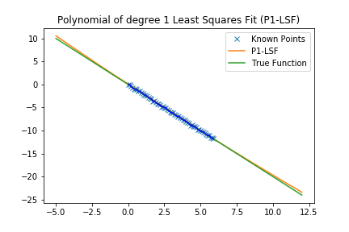
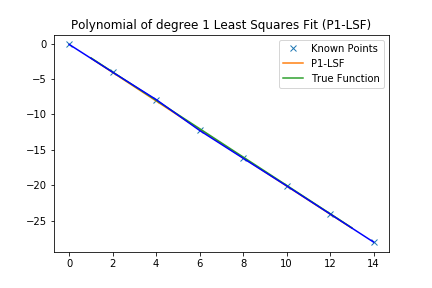
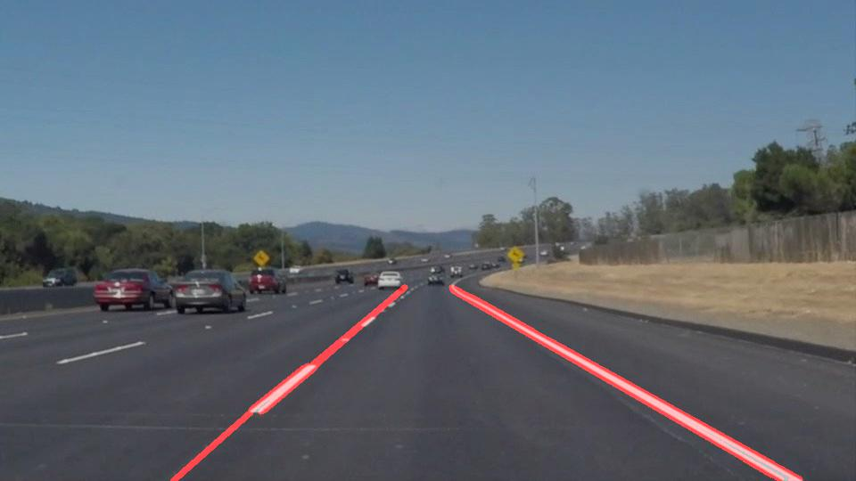
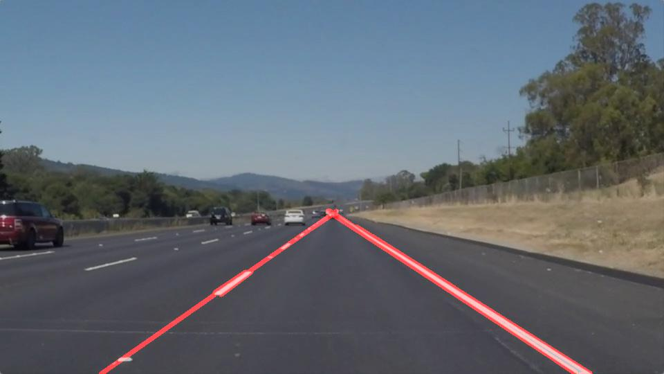
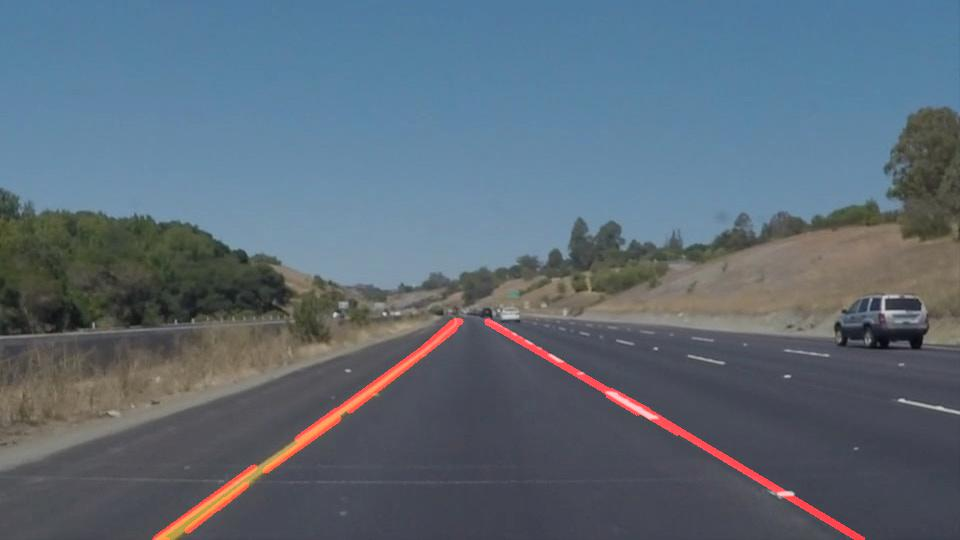
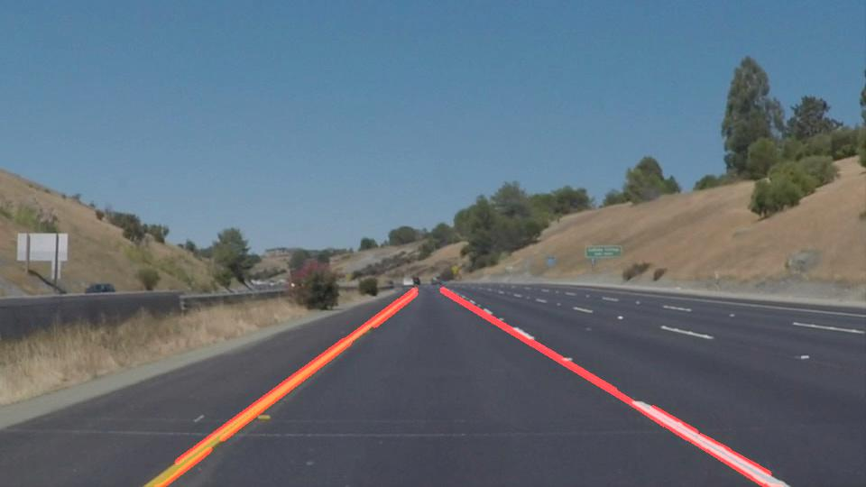
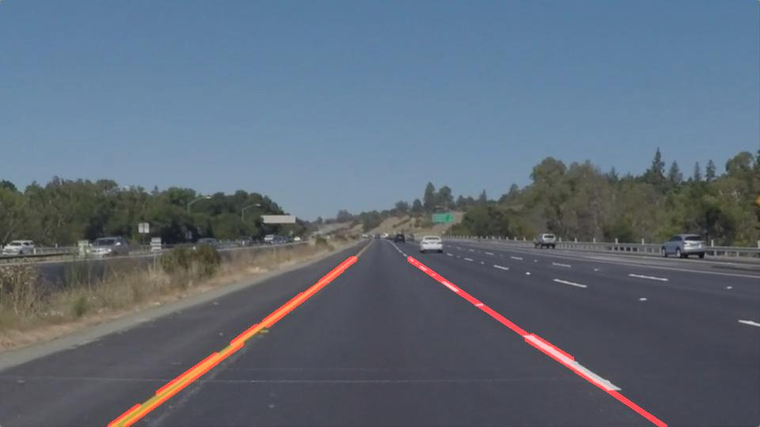
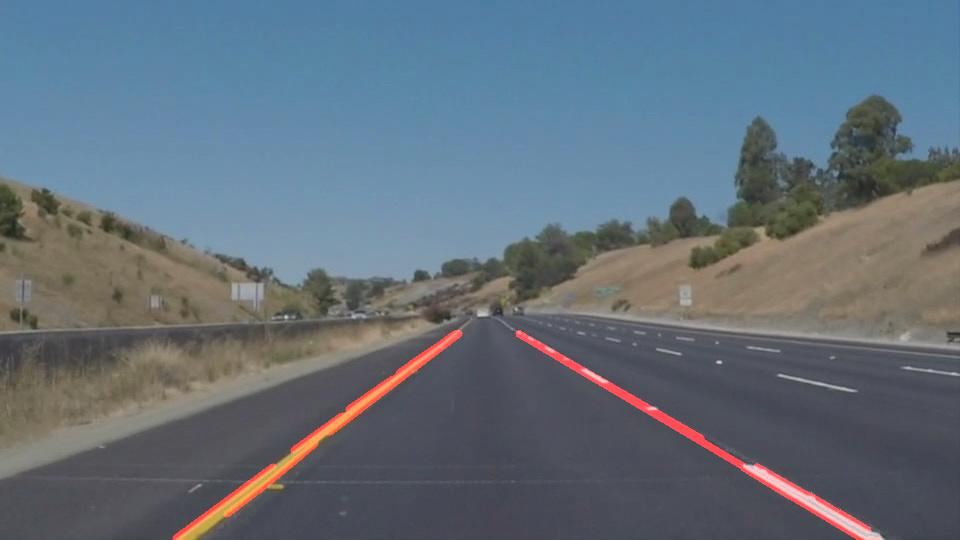

# **Finding Lane Lines on the Road** 

---

## Reflection

## 1. Pipeline description.

The pipeline consists of the following __main steps__ :

1. __Convert initial RGB image to to grayscale__. 
2. __Apply Gaussian smoothing__, before running Canny, which is essentially a way of suppressing noise and spurious gradients by averaging. A larger kernel_size implies averaging, or smoothing, over a larger area. The value used is tuned on tested videos and not automatically computed. 
3. __Perform Canny edge detection__. Thi algorithm will first detect strong edge (strong gradient) pixels above the high_threshold, and reject pixels below the low_threshold. Next, pixels with values between the low_threshold and high_threshold will be included as long as they are connected to strong edges. The output edges is a binary image with white pixels tracing out the detected edges and black everywhere else. Converting to grayscale has left us with an 8-bit image, so each pixel can take 2^8 = 256 possible values. Hence, the pixel values range from 0 to 255. This range implies that derivatives will be on the scale of tens or hundreds. So, a reasonable range for  threshold parameters would also be in the tens to hundreds.As far as a ratio of low_threshold to high_threshold, John Canny himself recommended a low to high ratio of 1:2 or 1:3. Here I'll use thresholds tuned on test videos. In case _contour conditions_ change, there is the possibility that such values need to recalibrated. An __auto-adaptive approach here would be useful__.   
4. __Define a region of interest and mask undesired portions of the image__. Here I'll use a quadrilateral whose vertices are tuned on test videos. In case the image height or width changes there is the possibility that such vertices need to be recalibrated. An __auto-adaptive approach here would be useful__.   
5. __Perform Hough transformation on Edge Detected Image__. Again, parameters such as distance and angular resolution of our grid in Hough space are tuned on test videos and not automatically computed. Also, we need to connect/average/extrapolate line segments (__draw_lines() __ function) in order to get "_desidered_" lane lines. I'll discuss my approach below.   
6. Finally, __apply detected lines to the original image__ as annotation.  

### draw_lines() function 

#### Extrapolation

In order to extrapolate lane lines, I will use the __polynomial of degree 1__ that is the __Least Squares Fit (P1-LSF)__ to the data. A possible __shortcoming__ could be the __linear assumption__ but will see that such assumption on test videos works even on curved lane lines. For more extreme cases than test videos, a possible improvement could be __comparing the sum of the weighted squared errors__ of the __polynomial of degree 1__ and the __polynomial of degree 2__ (or higher) that is the __Least Squares Fit__ to the data and then choosing the best degree (= with lowest error).    

For further details, see [numpy.polynomial.polynomial.polyfit](https://docs.scipy.org/doc/numpy-dev/reference/generated/numpy.polynomial.polynomial.polyfit.html) and [numpy.poly1d](https://docs.scipy.org/doc/numpy/reference/generated/numpy.poly1d.html#numpy.poly1d). 

#### Interpolation

Same approach of extrapolation. 

### Results 

<table>  
  <tr>
    <td></td>
    <td></td>
    <td></td>
  </tr>
  <tr>
    <td></td>
    <td></td>
    <td></td>
  </tr>
</table>  

## 2. Potential shortcomings with current pipeline

Potential shortcoming would be:

* Hough transformation on Edge Detected Image does not work properly if on a lane line there is an horizontal white line perpendicular to the lane line. This kind of "variations" happened in a couple of frames of the last video. 

## 3. Possible improvements to current pipeline

Possible improvements would be: 

* In order to handle cases where on a lane line there is an horizontal white line perpendicular to the lane line, 

  * we can perform clustering (e.g. k-means clustering with k=2) on slope for segments of left lane lines, right lane lines and potential noise such as white lines perpendicular to the lane line, discarding those segments whose slope are too far (outliers) from the centroids of the two main clusters (=assumed to be the real left lane lines and right lane lines). Of course, the concept itself of outlier needs to be further developed, as there are several possible outlier detection approaches that could be applied to this situation. A very easy approach for detecting slope outliers can be just adopting a tolerance range (e.g. discarding all segments whose slope is not in the 2 main centriods slope +/- DELTA radiants).      
  * we can leverage the symmetry of images, i.e. the left lane line is symmetric to the right lane line. For example, we can perform clustering just aggregating all segments with slope not so dissimilar (e.g. whose difference is <= a given threshold), computing the slope for each centriod of cluters identified and then selecting only the pair of clusters whose centroid slope is symmetric (i.e. Theta1=PI-Theta2). 

