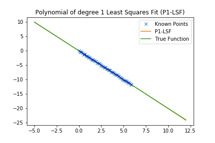

# **Finding Lane Lines on the Road** 

---

## Reflection

## 1. Pipeline description.

The pipeline consists of the following __main steps__ :

1. __Convert initial RGB image to to grayscale__. 
2. __Apply Gaussian smoothing__, before running Canny, which is essentially a way of suppressing noise and spurious gradients by averaging. A larger kernel_size implies averaging, or smoothing, over a larger area. The value used is tuned on tested videos and not automatically computed. 
3. __Perform Canny edge detection__. Thi algorithm will first detect strong edge (strong gradient) pixels above the high_threshold, and reject pixels below the low_threshold. Next, pixels with values between the low_threshold and high_threshold will be included as long as they are connected to strong edges. The output edges is a binary image with white pixels tracing out the detected edges and black everywhere else. Converting to grayscale has left us with an 8-bit image, so each pixel can take 2^8 = 256 possible values. Hence, the pixel values range from 0 to 255. This range implies that derivatives will be on the scale of tens or hundreds. So, a reasonable range for  threshold parameters would also be in the tens to hundreds.As far as a ratio of low_threshold to high_threshold, John Canny himself recommended a low to high ratio of 1:2 or 1:3. Here I'll use thresholds tuned on test videos. In case _contour conditions_ change, there is the possibility that such values need to recalibrated. An __auto-adaptive approach here would be useful__.   
4. __Define a region of interest and mask undesired portions of the image__. Here I'll use a quadrilateral whose vertices are tuned on test videos. In case the image height or width changes there is the possibility that such vertices need to be recalibrated. An __auto-adaptive approach here would be useful__.   
5. __Perform Hough transformation on Edge Detected Image__. Again, parameters such as distance and angular resolution of our grid in Hough space are tuned on test videos and not automatically computed. Also, we need to connect/average/extrapolate line segments (__draw_lines() __ function) in order to get "_desidered_" lane lines. I'll discuss my approach below.   
6. Finally, __apply detected lines to the original image__ as annotation.  

### draw_lines() function 

#### Extrapolation

In order to extrapolate lane lines, I will use the __polynomial of degree 1__ that is the __Least Squares Fit (P1-LSF)__ to the data. A possible __shortcoming__ can be the __linear assumption__ but will see that such assumption on test videos works. As possible improvement we could __compare the sum of the weighted squared errors__ of the __polynomial of degree 1__ and the __polynomial of degree 2__ that is the __Least Squares Fit__ to the data and choosing the best one.   

For further details, see [numpy.polynomial.polynomial.polyfit](https://docs.scipy.org/doc/numpy-dev/reference/generated/numpy.polynomial.polynomial.polyfit.html) and [numpy.poly1d](https://docs.scipy.org/doc/numpy/reference/generated/numpy.poly1d.html#numpy.poly1d). 

#### Interpolation

Same approach of extrapolation. 

## 2. Identify potential shortcomings with your current pipeline

One potential shortcoming would be what would happen when ... 

Another shortcoming could be ...

## 3. Suggest possible improvements to your pipeline

A possible improvement would be to ...

Another potential improvement could be to ...
