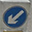
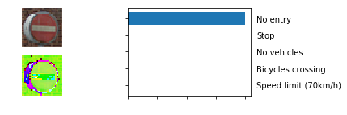

# Traffic Sign Recognition 

---

## Build a Traffic Sign Recognition Project

The goals / steps of this project are the following:

* Load the data set (see below for links to the project data set)
* Explore, summarize and visualize the data set
* Design, train and test a model architecture
* Use the model to make predictions on new images
* Analyze the softmax probabilities of the new images
* Summarize the results with a written report

## Rubric Points

Here I will consider the [rubric points](https://review.udacity.com/#!/rubrics/481/view) individually and describe how I addressed each point in my implementation

CRITERIA | MEETS SPECIFICATIONS | HOW I ADDRESSED THE POINT | 
--- | --- | --- |
Submission Files | The project submission includes all required files. | Traffic_Sign_Classifier.ipynb notebook file is part of this repository. An HTML export of the project notebook with the name report.html is part of this repository. Any additional datasets or images used for the project that are not from the German Traffic Sign Dataset is part of this repository. Writeup report as a markdown file is part of this repository |  
Dataset Summary | The submission includes a basic summary of the data set. |Please see section Data Set Summary & Exploration, and sub-sections 1. Provide a basic summary of the data set. In the code, the analysis should be done using python, numpy and/or pandas methods rather than hardcoding results manually, 2. Include an exploratory visualization of the dataset, 2.1 Frequency Distribution, 2.2 Checking for unbalanced classes, 2.3 Plot Signal Images |  
Exploratory Visualization | The submission includes an exploratory visualization on the dataset. |Please see section Data Set Summary & Exploration, and sub-sections 1. Provide a basic summary of the data set. In the code, the analysis should be done using python, numpy and/or pandas methods rather than hardcoding results manually, 2. Include an exploratory visualization of the dataset, 2.1 Frequency Distribution, 2.2 Checking for unbalanced classes, 2.3 Plot Signal Images |  
Preprocessing | The submission describes the preprocessing techniques used and why these techniques were chosen. |Please see section Design and Test a Model Architecture, and sub-sections 1. Describe how you preprocessed the image data. What techniques were chosen and why did you choose these techniques? Consider including images showing the output of each preprocessing technique. Pre-processing refers to techniques such as converting to grayscale, normalization, etc. (OPTIONAL: As described in the "Stand Out Suggestions" part of the rubric, if you generated additional data for training, describe why you decided to generate additional data, how you generated the data, and provide example images of the additional data. Then describe the characteristics of the augmented training set like number of images in the set, number of images for each class, etc.), 1.1. Normalization, 1.2. Conversion to YUV space |
Model Architecture | The submission provides details of the characteristics and qualities of the architecture, including the type of model used, the number of layers, and the size of each layer. Visualizations emphasizing particular qualities of the architecture are encouraged. |Please see section Design and Test a Model Architecture, and sub-sections 2. Describe what your final model architecture looks like including model type, layers, layer sizes, connectivity, etc.) Consider including a diagram and/or table describing the final model, Model Pipeline, Computational Graph from TensorBoard.  |
Model Training | The submission describes how the model was trained by discussing what optimizer was used, batch size, number of epochs and values for hyperparameters. |Please see section Design and Test a Model Architecture, and sub-sections 3. Describe how you trained your model. The discussion can include the type of optimizer, the batch size, number of epochs and any hyperparameters such as learning rate, 4. Describe the approach taken for finding a solution and getting the validation set accuracy to be at least 0.93. Include in the discussion the results on the training, validation and test sets and where in the code these were calculated. Your approach may have been an iterative process, in which case, outline the steps you took to get to the final solution and why you chose those steps. Perhaps your solution involved an already well known implementation or architecture. In this case, discuss why you think the architecture is suitable for the current problem |
Solution Approach | The submission describes the approach to finding a solution. Accuracy on the validation set is 0.93 or greater. |Please see section Design and Test a Model Architecture, and sub-sections 3. Describe how you trained your model. The discussion can include the type of optimizer, the batch size, number of epochs and any hyperparameters such as learning rate, 4. Describe the approach taken for finding a solution and getting the validation set accuracy to be at least 0.93. Include in the discussion the results on the training, validation and test sets and where in the code these were calculated. Your approach may have been an iterative process, in which case, outline the steps you took to get to the final solution and why you chose those steps. Perhaps your solution involved an already well known implementation or architecture. In this case, discuss why you think the architecture is suitable for the current problem |
Acquiring New Images | The submission includes five new German Traffic signs found on the web, and the images are visualized. Discussion is made as to particular qualities of the images or traffic signs in the images that are of interest, such as whether they would be difficult for the model to classify |Please see section Test a Model on New Images, and sub-sections 1. Choose at least five German traffic signs found on the web and provide them in the report. For each image, discuss what quality or qualities might be difficult to classify. |
Performance on New Images | The submission documents the performance of the model when tested on the captured images. The performance on the new images is compared to the accuracy results of the test set. |Please see section Test a Model on New Images, and sub-sections 2. Discuss the model's predictions on these new traffic signs and compare the results to predicting on the test set. At a minimum, discuss what the predictions were, the accuracy on these new predictions, and compare the accuracy to the accuracy on the test set (OPTIONAL: Discuss the results in more detail as described in the "Stand Out Suggestions" part of the rubric). |
Model Certainty - Softmax Probabilities | The top five softmax probabilities of the predictions on the captured images are outputted. The submission discusses how certain or uncertain the model is of its predictions. |Please see section Test a Model on New Images, and sub-sections 3. Describe how certain the model is when predicting on each of the five new images by looking at the softmax probabilities for each prediction. Provide the top 5 softmax probabilities for each image along with each probability. (OPTIONAL: as described in the "Stand Out Suggestions" part of the rubric, visualizations can also be provided such as bar charts) |

## Data Set Summary & Exploration

### 1. Provide a basic summary of the data set. In the code, the analysis should be done using python, numpy and/or pandas methods rather than hardcoding results manually.

I used [numpy](https://docs.scipy.org/doc/numpy/reference/generated/numpy.histogram.html) to calculate summary statistics of the traffic signs data set:

* The size of training set is 34,799 
* The size of the validation set is 4,410
* The size of test set is 12,630
* The shape of a traffic sign image is 32x32x3
* The number of unique classes/labels in the data set is 43

### 2. Include an exploratory visualization of the dataset.

Here is an exploratory visualization of the data set. 

#### 2.1 Frequency Distribution

#### 2.2 Checking for unbalanced classes

We can see clearly there are classes like 2 and 1 with 5.7% of training set vs. classes like 37 and 0 with 0.51% of training set.

#### 2.3 Plot Signal Images

## Design and Test a Model Architecture

### 1. Describe how you preprocessed the image data. What techniques were chosen and why did you choose these techniques? Consider including images showing the output of each preprocessing technique. Pre-processing refers to techniques such as converting to grayscale, normalization, etc. (OPTIONAL: As described in the "Stand Out Suggestions" part of the rubric, if you generated additional data for training, describe why you decided to generate additional data, how you generated the data, and provide example images of the additional data. Then describe the characteristics of the augmented training set like number of images in the set, number of images for each class, etc.)

I used the following preprocessing pipeline: 

* __normalization__, i.e. so that the data has mean zero and equal variance
* __conversion to YUV space__ as described in in [P. Sermanet, Y. LeCun, Traffic Sign Recognition with Multi-Scale Convolutional Networks Proceedings of International Joint Conference on Neural Networks (IJCNN'11), 2011](http://yann.lecun.com/exdb/publis/pdf/sermanet-ijcnn-11.pdf)

#### 1.1. Normalization 
Specifically, I used the recommended tranformation <code>pixel <- (pixel - 128)/ 128</code>

#### 1.2. Conversion to YUV space

After normalization, as shown in [P. Sermanet, Y. LeCun, Traffic Sign Recognition with Multi-Scale Convolutional Networks Proceedings of International Joint Conference on Neural Networks (IJCNN'11), 2011](http://yann.lecun.com/exdb/publis/pdf/sermanet-ijcnn-11.pdf), all 32x32 images are converted to YUV space. 

YUV encodes a color image taking human perception into account, allowing reduced bandwidth for chrominance components, thereby typically enabling transmission errors or compression artifacts to be more efficiently masked by the human perception than using a "direct" RGB-representation. 

Specifically, I used [skimage.color.rgb2yuv](http://scikit-image.org/docs/dev/api/skimage.color.html#skimage.color.rgb2yuv) function that uses [this approach for conversion from RGB](https://en.wikipedia.org/wiki/YUV#Conversion_to.2Ffrom_RGB). 

### 2. Describe what your final model architecture looks like including model type, layers, layer sizes, connectivity, etc.) Consider including a diagram and/or table describing the final model.

I started with the LeNet-5 solution from the lecture and here are the main nimprovments:

* __Local response normalization__ after activation functions of each convolutional layer; for further information see [A. Krizhevsky, I. Sutskever, G. E. Hinton, ImageNet Classification with Deep Convolutional Neural Networks, Advances in Neural Information Processing Systems 25 (NIPS 2012)](http://papers.nips.cc/paper/4824-imagenet-classification-with-deep-convolutional-neural-networks)
* __Max pooling strides__ [1,1,1,1] instead of [1,2,2,1]
* __Multi-Scale Features__, i.e. as shown in [P. Sermanet, Y. LeCun, Traffic Sign Recognition with Multi-Scale Convolutional Networks Proceedings of International Joint Conference on Neural Networks (IJCNN'11), 2011](http://yann.lecun.com/exdb/publis/pdf/sermanet-ijcnn-11.pdf) the output of the first stage is branched out and fed to the classifier, in addition to the output of the second stage
* __Dropout__, only during training with holding probabilities set to 0.5 
* __Fully connected classifier__ with number of hidden units 12118x800 (input), 800x84 (hidden), 84x43 (output) 

#### Model Pipeline 

| Layer         		|     Description	        					| 
|:---------------------:|:---------------------------------------------:| 
| Input         		| 32x32x3 YUV image   							| 
| Convolution 5x5     	| 1x1 stride, valid padding, outputs 28x28x6 	|
| RELU					|										|
| Local Response Normalization					|										|
| Max pooling	      	| kernel 2x2, 1x1 stride,  outputs 27x27x6 				|
| Convolution 5x5     	| 1x1 stride, valid padding, outputs 23x23x16 	|
| RELU					|											|
| Local Response Normalization					|										|
| Max pooling	      	| kernel 2x2, 1x1 stride,  outputs 22x22x16 				|
| Multi-Scale Features		| the output of the first stage is branched out and fed to the classifier, in addition to the output of the second stage, output 1x12118      									|
| Fully connected		| 12118x800        									|
| RELU					|											|
| DROPOUT					|				only for training, keep probabily = 0.5							|
| Fully connected		| 800x84        									|
| RELU					|											|
| DROPOUT					|				only for training, keep probabily = 0.5							|
| Fully connected		| 84x43, output 43 logits        									|
| Softmax				|        		output 43 predicted probabilities							|
 

#### Computational Graph from TensorBoard

### 3. Describe how you trained your model. The discussion can include the type of optimizer, the batch size, number of epochs and any hyperparameters such as learning rate.

To train the model, I used an optimizer that implements the [Adam algorithm](https://arxiv.org/abs/1412.6980) with learning rare set to 0.001, 30 epochs and batch size set to 128. I found out that:

* the __random inizialization__ from the lecture (gaussian distribution with mean 0 and 0.1 as standard deviation) works fine and there are not convergence problems
* the use of __dropout__ allows to __avoid overfitting problems__ as I discovered that even with an higher number of epochs test accuracy don't change (using the rule of 30); hence, I used 30 epochs although I could use 20 eopochs having same results; same observations for learning rate     

### 4. Describe the approach taken for finding a solution and getting the validation set accuracy to be at least 0.93. Include in the discussion the results on the training, validation and test sets and where in the code these were calculated. Your approach may have been an iterative process, in which case, outline the steps you took to get to the final solution and why you chose those steps. Perhaps your solution involved an already well known implementation or architecture. In this case, discuss why you think the architecture is suitable for the current problem.

My final model results were:

* __training set accuracy of 100%__
* __validation set accuracy of 96.6%__
* __test set accuracy of 96.0%__

I was insipred by [P. Sermanet, Y. LeCun, Traffic Sign Recognition with Multi-Scale Convolutional Networks Proceedings of International Joint Conference on Neural Networks (IJCNN'11), 2011](http://yann.lecun.com/exdb/publis/pdf/sermanet-ijcnn-11.pdf) although I did not implement the same architecture. Specifically, I used only the first two convolutional layers. Also, after my experiments I decided to use 

* __Local response normalization__ after activation functions of each convolutional layer; for further information see [A. Krizhevsky, I. Sutskever, G. E. Hinton, ImageNet Classification with Deep Convolutional Neural Networks, Advances in Neural Information Processing Systems 25 (NIPS 2012)](http://papers.nips.cc/paper/4824-imagenet-classification-with-deep-convolutional-neural-networks)
* __Max pooling strides__ [1,1,1,1] instead of [1,2,2,1]
* __Multi-Scale Features__, i.e. as shown in [P. Sermanet, Y. LeCun, Traffic Sign Recognition with Multi-Scale Convolutional Networks Proceedings of International Joint Conference on Neural Networks (IJCNN'11), 2011](http://yann.lecun.com/exdb/publis/pdf/sermanet-ijcnn-11.pdf) the output of the first stage is branched out and fed to the classifier, in addition to the output of the second stage
* __Dropout__, only during training with holding probabilities set to 0.5 
* __Fully connected classifier__ with number of hidden units 12118x800 (input), 800x84 (hidden), 84x43 (output) 

The main improvements came from 

* __Multi-Scale Features__ 
* __Dropout__
* __Max pooling strides__ [1,1,1,1] instead of [1,2,2,1]

The use of __dropout__ allows to __avoid overfitting problems__ as I discovered that even with an higher number of epochs test accuracy don't change (using the rule of 30); hence, I used 30 epochs although I could use 20 eopochs having same results. 

I am confident my architecture can be extended to achieve >99% accuracy using more convolutional layers as shown in [P. Sermanet, Y. LeCun, Traffic Sign Recognition with Multi-Scale Convolutional Networks Proceedings of International Joint Conference on Neural Networks (IJCNN'11), 2011](http://yann.lecun.com/exdb/publis/pdf/sermanet-ijcnn-11.pdf)

## Test a Model on New Images

### 1. Choose at least five German traffic signs found on the web and provide them in the report. For each image, discuss what quality or qualities might be difficult to classify.

#### German traffic signs that I found on the web

00 -   01 -   02 -   
03 -   04 -   05 -   
06 -   07 -   08 -   
09 -   10 -   11 -   
12 -   13 -   14 -   
15 -   16 -   17 -   
18 -   19 -   20 -   
21 -   22 -   23 -   
24 -   25 -   26 -   
27 -   28 -   29 -   
30 -   31 -   32 -   
33 -   34 -   35 -   
36 -   37 -      

#### Eventual qualities might be difficult to classify

0. [Class = 21] - The double curve sign can be easily confused with dangerous curves to the left sign; probably here more complex features (=adding more convolutional layers in pyramid scheme) than the ones made with only 2 convolutional layers would be useful to the classifier   
1. [Class = 39] - None 
2. [Class = 17] - The angle of the sign is different from any other image of the same class 
3. [Class = 17] - None 
4. [Class = 17] - None 
5. [Class = 17] - None 
6. [Class = 39] - None 
7. [Class = 40] - None 
8. [Class = 40] - None
9. [Class = 34] - None
10. [Class = 28] - The design of children is not easy to be classified and can be easily confused; probably here more complex features (=adding more convolutional layers in pyramid scheme) than the ones made with only 2 convolutional layers would be useful to the classifier   
11. [Class = 39] - None
12. [Class = 0] - The number "20" is not easy to be classified and can be easily confused with other numbers (e.g. "50", "30", "80"); probably here more complex features (=adding more convolutional layers in pyramid scheme) than the ones made with only 2 convolutional layers would be useful to the classifier 
13. [Class = 17] - None
14. [Class = 38] - None
15. [Class = 13] - None
16. [Class = 40] - None
17. [Class = 13] - None
18. [Class = 38] - None
19. [Class = 38] - None
20. [Class = 11] - None
21. [Class = 00] - The number "20" is not easy to be classified and can be easily confused with other numbers (e.g. "50", "30", "80"); probably here more complex features (=adding more convolutional layers in pyramid scheme) than the ones made with only 2 convolutional layers would be useful to the classifier 
22. [Class = 28] - None
23. [Class = 0] - The number "20" is not easy to be classified and can be easily confused with other numbers (e.g. "50", "30", "80"); probably here more complex features (=adding more convolutional layers in pyramid scheme) than the ones made with only 2 convolutional layers would be useful to the classifier 
24. [Class = 99] - UNKNOWN - This symbol does not belong to any of 43 known classes and it has been added only for study the classifier behaviour with unknown signs 
25. [Class = 99] - UNKNOWN - This symbol does not belong to any of 43 known classes and it has been added only for study the classifier behaviour with unknown signs 
26. [Class = 99] - UNKNOWN - This symbol does not belong to any of 43 known classes and it has been added only for study the classifier behaviour with unknown signs 
27. [Class = 32] - This sign looks like not very similar to the signs of the same class as it has 2 diagonals lines instead of only one  
28. [Class = 40] - None
29. [Class = 28] - None
30. [Class = 40] - None
31. [Class = 40] - None
32. [Class = 28] - The design of children is not easy to be classified and can be easily confused; probably here more complex features (=adding more convolutional layers in pyramid scheme) than the ones made with only 2 convolutional layers would be useful to the classifier
33. [Class = 24] - Road narrows on the right sign has two lines in the middle that are not easy to recognize; probably here more complex features (=adding more convolutional layers in pyramid scheme) than the ones made with only 2 convolutional layers would be useful to the classifier  
34. [Class = 0] - The number "20" is not easy to be classified and can be easily confused with other numbers (e.g. "50", "30", "80"); probably here more complex features (=adding more convolutional layers in pyramid scheme) than the ones made with only 2 convolutional layers would be useful to the classifier 
35. [Class = 0] - The number "20" is not easy to be classified and can be easily confused with other numbers (e.g. "50", "30", "80"); probably here more complex features (=adding more convolutional layers in pyramid scheme) than the ones made with only 2 convolutional layers would be useful to the classifier 
36. [Class = 0] - The number "20" is not easy to be classified and can be easily confused with other numbers (e.g. "50", "30", "80"); probably here more complex features (=adding more convolutional layers in pyramid scheme) than the ones made with only 2 convolutional layers would be useful to the classifier  
37. [Class = 0] - The number "20" is not easy to be classified and can be easily confused with other numbers (e.g. "50", "30", "80"); probably here more complex features (=adding more convolutional layers in pyramid scheme) than the ones made with only 2 convolutional layers would be useful to the classifier  

### 2. Discuss the model's predictions on these new traffic signs and compare the results to predicting on the test set. At a minimum, discuss what the predictions were, the accuracy on these new predictions, and compare the accuracy to the accuracy on the test set (OPTIONAL: Discuss the results in more detail as described in the "Stand Out Suggestions" part of the rubric).

The model was able to achieve __Accuracy of 80.0%__, i.e. 28 corrected predictions out of 35 cases (3 images did not belong to any of 43 known classes and they have been added only for study the classifier behaviour with unknown signs). 

Here are the results of the prediction with related comments:

0. [Class = 21 , Predicted = 35] - The double curve sign can be easily confused with dangerous curves to the left sign; probably here more complex features (=adding more convolutional layers in pyramid scheme) than the ones made with only 2 convolutional layers would be useful to the classifier   
1. [Class = 39 , Predicted = 39] - None 
2. [Class = 17, Predicted = 17] - The angle of the sign is different from any other image of the same class 
3. [Class = 17, Predicted = 17] - None 
4. [Class = 17, Predicted = 17] - None 
5. [Class = 17, Predicted = 39] - None 
6. [Class = 39, Predicted = 39] - None 
7. [Class = 40, Predicted = 40] - None 
8. [Class = 40, Predicted = 40] - None
9. [Class = 34, Predicted = 34] - None
10. [Class = 28, Predicted = 28] - None   
11. [Class = 39, Predicted = 39] - None
12. [Class = 0, Predicted = 5] - The number "20" is not easy to be classified and can be easily confused with other numbers (e.g. "50", "30", "80"); probably here more complex features (=adding more convolutional layers in pyramid scheme) than the ones made with only 2 convolutional layers would be useful to the classifier 
13. [Class = 17, Predicted = 17] - None
14. [Class = 38, Predicted = 38] - None
15. [Class = 13, Predicted = 13] - None
16. [Class = 40, Predicted = 40] - None
17. [Class = 13, Predicted = 13] - None
18. [Class = 38, Predicted = 38] - None
19. [Class = 38, Predicted = 38] - None
20. [Class = 11, Predicted = 11] - None
21. [Class = 0, Predicted = 5] - The number "20" is not easy to be classified and can be easily confused with other numbers (e.g. "50", "30", "80"); probably here more complex features (=adding more convolutional layers in pyramid scheme) than the ones made with only 2 convolutional layers would be useful to the classifier 
22. [Class = 28, Predicted = 28] - None
23. [Class = 0, Predicted = 7] - The number "20" is not easy to be classified and can be easily confused with other numbers (e.g. "50", "30", "80"); probably here more complex features (=adding more convolutional layers in pyramid scheme) than the ones made with only 2 convolutional layers would be useful to the classifier 
24. [Class = 99, Predicted = 20] - UNKNOWN - This symbol does not belong to any of 43 known classes and it has been added only for study the classifier behaviour with unknown signs 
25. [Class = 99, Predicted = 13] - UNKNOWN - This symbol does not belong to any of 43 known classes and it has been added only for study the classifier behaviour with unknown signs 
26. [Class = 99, Predicted = 7] - UNKNOWN - This symbol does not belong to any of 43 known classes and it has been added only for study the classifier behaviour with unknown signs 
27. [Class = 32, Predicted = 1] - This sign looks like not very similar to the signs of the same class as it has 2 diagonals lines instead of only one  
28. [Class = 40, Predicted = 40] - None
29. [Class = 28, Predicted = 28] - None
30. [Class = 40, Predicted = 40] - None
31. [Class = 40, Predicted = 40] - None
32. [Class = 28, Predicted = 28] - None
33. [Class = 24, Predicted = 24] - None
34. [Class = 0, Predicted = 0] - None 
35. [Class = 0, Predicted = 0] - None
36. [Class = 0, Predicted = 5] - The number "20" is not easy to be classified and can be easily confused with other numbers (e.g. "50", "30", "80"); probably here more complex features (=adding more convolutional layers in pyramid scheme) than the ones made with only 2 convolutional layers would be useful to the classifier  
37. [Class = 0, Predicted = 3] - The number "20" is not easy to be classified and can be easily confused with other numbers (e.g. "50", "30", "80"); probably here more complex features (=adding more convolutional layers in pyramid scheme) than the ones made with only 2 convolutional layers would be useful to the classifier

### 3. Describe how certain the model is when predicting on each of the five new images by looking at the softmax probabilities for each prediction. Provide the top 5 softmax probabilities for each image along with each probability. (OPTIONAL: as described in the "Stand Out Suggestions" part of the rubric, visualizations can also be provided such as bar charts)

The code for making predictions on my final model is located in the cell N. 22 of the Ipython notebook.

Here below you can find the top 5 softmax probabilities for each image along with each probability and visualizations are provided such as bar charts. For the exact values of predicted probabilities, please see cell N. 24 of the Ipython notebook.

0  - Actual Class  21 [ Double curve ] - Predicted Class: 35 [ Ahead only ] 
  

1  - Actual Class  39 [ Keep left ] - Predicted Class: 39 [ Keep left ]
  

2  - Actual Class  17 [ No entry ] - Predicted Class: 17 [ No entry ]

  

3  - Actual Class  17 [ No entry ] - Predicted Class: 17 [ No entry ]

  

4  - Actual Class  17 [ No entry ] - Predicted Class: 17 [ No entry ]

  

5  - Actual Class  39 [ Keep left ] - Predicted Class: 39 [ Keep left ]

  

6  - Actual Class  39 [ Keep left ] - Predicted Class: 39 [ Keep left ]
  

7  - Actual Class  40 [ Roundabout mandatory ] - Predicted Class: 40 [ Roundabout mandatory ]
  

8  - Actual Class  40 [ Roundabout mandatory ] - Predicted Class: 40 [ Roundabout mandatory ]
  

9  - Actual Class  34 [ Turn left ahead ] - Predicted Class: 34 [ Turn left ahead ]
  

10  - Actual Class  28 [ Children crossing ] - Predicted Class: 28 [ Children crossing ]
  

11  - Actual Class  39 [ Keep left ] - Predicted Class: 39 [ Keep left ]
  

12  - Actual Class  0 [ Speed limit (20km/h) ] - Predicted Class: 5 [ Speed limit (80km/h) ]
  

0  - Actual Class  21 [ Double curve ] - Predicted Class: 35 [ Ahead only ] 
  

0  - Actual Class  21 [ Double curve ] - Predicted Class: 35 [ Ahead only ] 
  

0  - Actual Class  21 [ Double curve ] - Predicted Class: 35 [ Ahead only ] 
  

0  - Actual Class  21 [ Double curve ] - Predicted Class: 35 [ Ahead only ] 
  

0  - Actual Class  21 [ Double curve ] - Predicted Class: 35 [ Ahead only ] 
  

0  - Actual Class  21 [ Double curve ] - Predicted Class: 35 [ Ahead only ] 
  

0  - Actual Class  21 [ Double curve ] - Predicted Class: 35 [ Ahead only ] 
  

0  - Actual Class  21 [ Double curve ] - Predicted Class: 35 [ Ahead only ] 
  

0  - Actual Class  21 [ Double curve ] - Predicted Class: 35 [ Ahead only ] 
  

0  - Actual Class  21 [ Double curve ] - Predicted Class: 35 [ Ahead only ] 
  

0  - Actual Class  21 [ Double curve ] - Predicted Class: 35 [ Ahead only ] 
  

0  - Actual Class  21 [ Double curve ] - Predicted Class: 35 [ Ahead only ] 
  

0  - Actual Class  21 [ Double curve ] - Predicted Class: 35 [ Ahead only ] 
  

0  - Actual Class  21 [ Double curve ] - Predicted Class: 35 [ Ahead only ] 
  

0  - Actual Class  21 [ Double curve ] - Predicted Class: 35 [ Ahead only ] 
  

0  - Actual Class  21 [ Double curve ] - Predicted Class: 35 [ Ahead only ] 
  

0  - Actual Class  21 [ Double curve ] - Predicted Class: 35 [ Ahead only ] 
  

0  - Actual Class  21 [ Double curve ] - Predicted Class: 35 [ Ahead only ] 
  

0  - Actual Class  21 [ Double curve ] - Predicted Class: 35 [ Ahead only ] 
  

0  - Actual Class  21 [ Double curve ] - Predicted Class: 35 [ Ahead only ] 
  

0  - Actual Class  21 [ Double curve ] - Predicted Class: 35 [ Ahead only ] 
  

0  - Actual Class  21 [ Double curve ] - Predicted Class: 35 [ Ahead only ] 
  

0  - Actual Class  21 [ Double curve ] - Predicted Class: 35 [ Ahead only ] 
  

0  - Actual Class  21 [ Double curve ] - Predicted Class: 35 [ Ahead only ] 
  

0  - Actual Class  21 [ Double curve ] - Predicted Class: 35 [ Ahead only ] 
  

0  - Actual Class  21 [ Double curve ] - Predicted Class: 35 [ Ahead only ] 
  

0  - Actual Class  21 [ Double curve ] - Predicted Class: 35 [ Ahead only ] 
  

## (Optional) Visualizing the Neural Network (See Step 4 of the Ipython notebook for more details)
### 1. Discuss the visual output of your trained network's feature maps. What characteristics did the neural network use to make classifications?

The feature map activations clearly show the outline of the traffic signs, i.e. the CNN finds useful information.
Here below you can find the visual output of trained network's feature maps for a sample of 10 new images imported from the web.  

