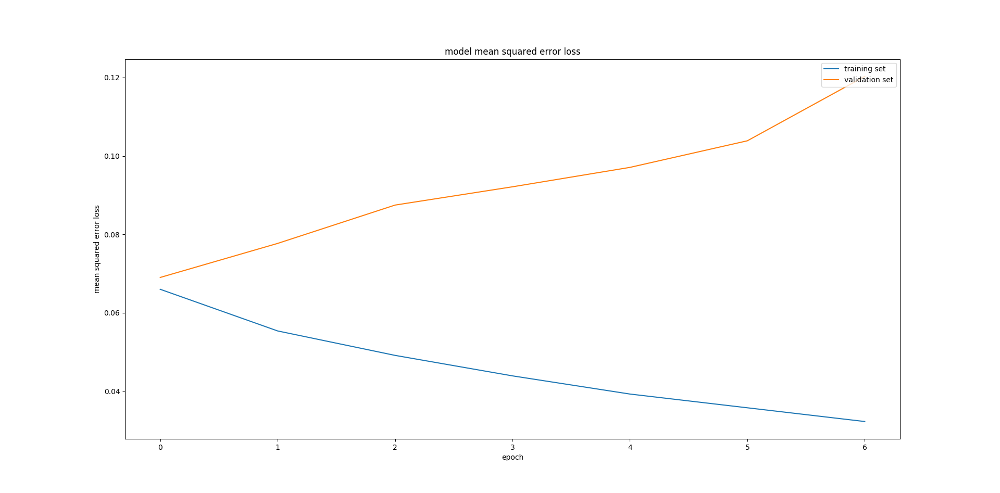
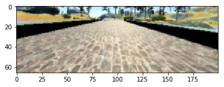

# Behaviorial Cloning Project

[](http://www.udacity.com/drive)

## Overview

The goals / steps of this project are the following:
* Use the simulator to collect data of good driving behavior 
* Design, train and validate a model that predicts a steering angle from image data
* Use the model to drive the vehicle autonomously around the first track in the simulator (the vehicle should remain on the road for an entire loop around the track)
* Summarize the results with a written report

The following resources can be found in this github repository:
* [__model.py__](https://github.com/gtesei/SelfDrivingCars/blob/master/P3-CarND-Behavioral-Cloning/model.py) containing the script to create and train the model
* [__drive.py__](https://github.com/gtesei/SelfDrivingCars/blob/master/P3-CarND-Behavioral-Cloning/video.py) for driving the car in autonomous mode
* __model.h5__ containing a trained convolution neural network 
* [__writeup_report.md__](https://github.com/gtesei/SelfDrivingCars/blob/master/P3-CarND-Behavioral-Cloning/writeup_report.md) summarizing the results
* __video.mp4__ containing the video showing that the vehicle is able to drive autonomously around the track without leaving the road (see on [YouTube](https://youtu.be/lzqxdYs-e4Y))

## Details About Files In This Directory

### `model.py`

The __model.py__ file contains the code for training and saving the convolution neural network. The file shows the pipeline I used for training and validating the model, and it contains comments to explain how the code works. Also, the script can be parametrized as here explained:  

OPTION | SELECTOR | DEFAULT | DESCRIPTION | 
--- | --- | --- | --- |
__data directory__ | '-d' | default='data' | |
__test size fraction__ |'-t' | default=0.2 | |
__drop out probability__ | '-k' | default=0.5 | |
__number of epochs__ | '-n' | default=3 | |
__batch size__ | '-b' | default=32 | |
__learning rate__ | '-l'| default=1.0e-4 | |
__visualize loss__ | '-v' | default=0  | if enabled, it plots the training and validation loss for each epoch |
__output model__ | '-o'| default='model.h5' | |
__flip images__ | '-d'| default=1 | if enabled, it augment the images by flipping images and taking the opposite sign of the steering measurement | 
__rand brightness__ | '-d' | default=1 | if enabled, it augment the images by augment brightness randomly |

### `drive.py`

Usage of `drive.py` requires you have saved the trained model as an h5 file, i.e. `model.h5`. See the [Keras documentation](https://keras.io/getting-started/faq/#how-can-i-save-a-keras-model) for how to create this file using the following command:
```sh
model.save(filepath)
```

Once the model has been saved, it can be used with drive.py using this command:

```sh
python drive.py model.h5
```

The above command will load the trained model and use the model to make predictions on individual images in real-time and send the predicted angle back to the server via a websocket connection.

Note: There is known local system's setting issue with replacing "," with "." when using drive.py. When this happens it can make predicted steering values clipped to max/min values. If this occurs, a known fix for this is to add "export LANG=en_US.utf8" to the bashrc file.

#### Saving a video of the autonomous agent

```sh
python drive.py model.h5 run1
```

The fourth argument, `run1`, is the directory in which to save the images seen by the agent. If the directory already exists, it'll be overwritten.

```sh
ls run1

[2017-01-09 16:10:23 EST]  12KiB 2017_01_09_21_10_23_424.jpg
[2017-01-09 16:10:23 EST]  12KiB 2017_01_09_21_10_23_451.jpg
[2017-01-09 16:10:23 EST]  12KiB 2017_01_09_21_10_23_477.jpg
[2017-01-09 16:10:23 EST]  12KiB 2017_01_09_21_10_23_528.jpg
[2017-01-09 16:10:23 EST]  12KiB 2017_01_09_21_10_23_573.jpg
[2017-01-09 16:10:23 EST]  12KiB 2017_01_09_21_10_23_618.jpg
[2017-01-09 16:10:23 EST]  12KiB 2017_01_09_21_10_23_697.jpg
[2017-01-09 16:10:23 EST]  12KiB 2017_01_09_21_10_23_723.jpg
[2017-01-09 16:10:23 EST]  12KiB 2017_01_09_21_10_23_749.jpg
[2017-01-09 16:10:23 EST]  12KiB 2017_01_09_21_10_23_817.jpg
...
```

The image file name is a timestamp of when the image was seen. This information is used by `video.py` to create a chronological video of the agent driving.

### `video.py`

```sh
python video.py run1
```

Creates a video based on images found in the `run1` directory. The name of the video will be the name of the directory followed by `'.mp4'`, so, in this case the video will be `run1.mp4`.

Optionally, one can specify the FPS (frames per second) of the video:

```sh
python video.py run1 --fps 48
```

Will run the video at 48 FPS. The default FPS is 60.

## Model Architecture and Training Strategy

#### 1. An appropriate model architecture has been employed

The model (model.py, lines 76-114) is ispired to the convolution neural network described in [Mariusz Bojarski et al., _End to End Learning for Self-Driving Cars_, arXiv:1604.07316v1 [cs.CV] 25 Apr 2016](http://images.nvidia.com/content/tegra/automotive/images/2016/solutions/pdf/end-to-end-dl-using-px.pdf) 


The network architecture consists of 9 layers, including a normalization layer, 5 convolutional layers and 3 fully connected layers:

* The input image is properly cropped and passed to the network 
* The first layer of the network performs image normalization
* The convolutional layers are designed to perform feature extraction and were chosen empirically through a series of experiments that varied layer configurations. We use strided convolutions in the first three convolutional layers with a 2x2 stride and a 5x5 kernel and a non-strided convolution with a 3x3 kernel size in the last two convolutional layers
* We follow the five convolutional layers with a dropout layer for reducing overfitting  
* We follow the dropout layer with three fully connected layers leading to an output control value which is the inverse turning radius 


#### 2. Attempts to reduce overfitting in the model

The model contains a dropout layer in order to reduce overfitting (model.py, line 106) and it was trained and validated on different data sets to ensure that the model was not overfitting (code line 124-132). The model was tested by running it through the simulator and ensuring that the vehicle could stay on the track. As below shown, the __best drop out probability__ is __0.5__. 


##### **Drop out probability set to 0**

 


##### **Drop out probability set to 0.5**

 


##### **Drop out probability set to 0.75**

 


#### 3. Model parameter tuning

The model used an __Adam optimizer__  (model.py line 138), that is an algorithm for first-order gradient-based optimization of stochastic objective functions, based on adaptive estimates of lower-order moments. For further details, see [Diederik P. Kingma et al, _ADAM: A METHOD FOR STOCHASTIC OPTIMIZATION_, arXiv:1412.6980v8 [cs.LG] 23 Jul 2015](https://arxiv.org/pdf/1412.6980v8.pdf). 

#### 4. Appropriate training data

Training data was chosen to keep the vehicle driving on the road. I used a combination of driving on track using center and driving counter-clockwise to reduce left turn bias. 

For details about how I created the training data, see the next section. 

## Model Architecture and Training Strategy

#### 1. Solution Design Approach

* My first step was to use [sample training data](https://d17h27t6h515a5.cloudfront.net/topher/2016/December/584f6edd_data/data.zip) to train a simple linear regressor. As the track and the brightness were different I applied the grayscale transformation and gaussian blur ( kernel_size=5) to images in order to reuse these data on the track of simulator; related results were not bad and I interpreted this as a sign that a better regressor could have been sucessfull; 
* Hence, I used the data described above to feed a Convolutional Neural Network and the car in autonomous mode drove in satisfactory way except for the big curve after the bridge that the car was not able to do properly; 
* In order to fix the problem I augmented data by using several techniques such as flipping images and taking the opposite sign of the steering measurement but without fixing the problem 
* Hence, I decided to change approach: using the training data of a different track of the simulator was probably too stretch, so I collected 3 train sets by using the simulator in training mode:
    * the first train set was collected by driving the car on track using center lane  
    * the second train set was collected recovering from the left side and right sides of the road back to center
    * the third train set was collected by driving on track one using center lane counter-clockwise 
* Also, I used the convolution neural network described in [Mariusz Bojarski et al., _End to End Learning for Self-Driving Cars_, arXiv:1604.07316v1 [cs.CV] 25 Apr 2016](http://images.nvidia.com/content/tegra/automotive/images/2016/solutions/pdf/end-to-end-dl-using-px.pdf) adding a dropout layer to reduce overfitting     
* In order to gauge how well the model was working, I split my image and steering angle data into a training and validation set (by default 20%)
* To combat the overfitting, I tuned the drop out probability as described above   
* The final step was to run the simulator to see how well the car was driving around track one and the vehicle was able to drive autonomously around the track without leaving the road

#### 2. Final Model Architecture

The final model architecture was inspired to [Mariusz Bojarski et al., _End to End Learning for Self-Driving Cars_, arXiv:1604.07316v1 [cs.CV] 25 Apr 2016](http://images.nvidia.com/content/tegra/automotive/images/2016/solutions/pdf/end-to-end-dl-using-px.pdf) and it consisted of a convolution neural network with 9 layers, including a normalization layer, 5 convolutional layers and 3 fully connected layers:

* The input image is properly cropped and passed to the network 
* The first layer of the network performs image normalization
* The convolutional layers are designed to perform feature extraction and were chosen empirically through a series of experiments that varied layer configurations. We use strided convolutions in the first three convolutional layers with a 2x2 stride and a 5x5 kernel and a non-strided convolution with a 3x3 kernel size in the last two convolutional layers
* We follow the five convolutional layers with a dropout layer for reducing overfitting  
* We follow the dropout layer with three fully connected layers leading to an output control value which is the inverse turning radius 

Here is a detailed description of the architecture. 

| Layer         		|     Description	        					| 
|:---------------------:|:---------------------------------------------:| 
| Input         		| 66x200x3 RGB resized and cropped images    							| 
| Image normalization     	|  	|
| Convolution 5x5     	| filter: 24, strides: 2x2 	|
| ELU					|										|
| Convolution 5x5     	| filter: 36, strides: 2x2 	|
| ELU					|										|
| Convolution 5x5     	| filter: 48, strides: 2x2	|
| ELU					|										|
| Convolution 5x5     	| filter: 64, strides: 1x1 	|
| ELU					|										|
| Convolution 5x5     	| filter: 64, strides: 1x1 	|
| ELU					|										|
| DROPOUT					|				only for training, keep probabily = 0.5							|
| Fully connected		| 100 neurons        									|
| Fully connected		| 50 neurons        									|
| Fully connected		| 10 neurons        									|
| Fully connected		| 1 neurons        									|


Here is a visualization of the original architecture from [Mariusz Bojarski et al., _End to End Learning for Self-Driving Cars_, arXiv:1604.07316v1 [cs.CV] 25 Apr 2016](http://images.nvidia.com/content/tegra/automotive/images/2016/solutions/pdf/end-to-end-dl-using-px.pdf) that is a special case of the above one (drop out probability set to 0). 


 


#### 3. Creation of the Training Set & Training Process

To capture good driving behavior, I recorded __three laps__: 

1. I first recorded one lap on track one using __center lane driving__. 
2. Then I recorded one lap the vehicle __recovering from the left side and right sides of the road back to center__ so that the vehicle would learn how to recover from not central positions. 
3. Finally I recorded one lap __driving counter-clockwise__ to reduce left turn bias.  

Here are some sample (resized and cropped) images. 

__On track one using center lane driving__

  
  
  


__Recovering from the left side and right sides of the road back to center__

  
  
  


__Driving counter-clockwise__

  
  
  


__To augment the data__, I designed the script ```model.py``` so that it would be possible to  

1. __use multiple cameras__ adjusting the steering measurements for the side camera images (model.py, lines 46-58), 
2. __flip images__ and taking the opposite sign of the steering measurement (model.py, lines 60-62, __enabled, by default__) 
3. __modify brightness randomly__ (model.py, lines 64-68, __enabled, by default__) 


After the collection process, using __default settings__, I had __74,052 data points__. I then preprocessed this data by just resizing and cropping to have 66x200 RGB images. 

I finally randomly shuffled the data set and put 20% of the data into a validation set. 

I used this training data for training the model. The validation set helped determine if the model was over or under fitting. The __best drop out probability__ is __0.5__ as shown in section __Attempts to reduce overfitting in the model__. Assuming such drop out probability, the ideal number of epochs was 3 as evidenced by the plot in section __Attempts to reduce overfitting in the model__ and here reported for convenience. 
 
  
 
I used an __Adam optimizer__ (model.py line 138), that is an algorithm for first-order gradient-based optimization of stochastic objective functions, based on adaptive estimates of lower-order moments. For further details, see [Diederik P. Kingma et al, _ADAM: A METHOD FOR STOCHASTIC OPTIMIZATION_, arXiv:1412.6980v8 [cs.LG] 23 Jul 2015](https://arxiv.org/pdf/1412.6980v8.pdf). 

## Observations 

* To avoid the zig-zag oscillating motion of the car, you may apply the correction to the steering values only when the steering angle value is greater than a certain value (0.15 seems to be a reasonable angle). This should allow for a much smoother drive allowing the vehicle to drift a tolerable amount without the rapid frame-by-frame movement of steering.
* You may also use Keras to graphically visualize your model architecture - https://keras.io/visualization/ 
* Note that Keras also provides a number of callback functions that you may use to decide upon the training parameters. Fr example, you may use the ModelCheckpoint callback to save the model after every epoch. Or you may use the EarlyStopping callback to stop training when a monitored quantity has stopped improving. You may refer to https://keras.io/callbacks/

## Dependencies

* [CarND Term1 Starter Kit](https://github.com/udacity/CarND-Term1-Starter-Kit)

## Further Resources 

* https://www.youtube.com/watch?v=rpxZ87YFg0M
* http://selfdrivingcars.mit.edu/
* http://images.nvidia.com/content/tegra/automotive/images/2016/solutions/pdf/end-to-end-dl-using-px.pdf
* http://jacobgil.github.io/deeplearning/vehicle-steering-angle-visualizations
* http://medium.com/udacity/teaching-a-machine-to-steer-a-car-d73217f2492c
* http://chatbotslife.com/using-augmentation-to-mimic-human-driving-496b569760a9
* Michael A. Nielsen, "Neural Networks and Deep Learning", Determination Press, 2015
