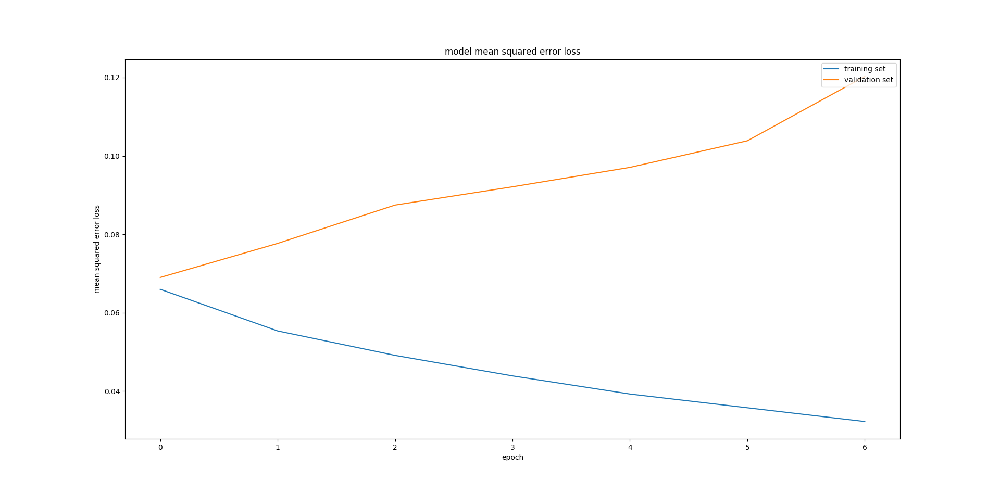
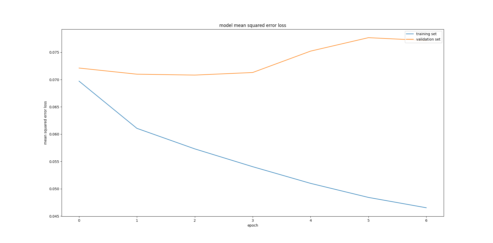
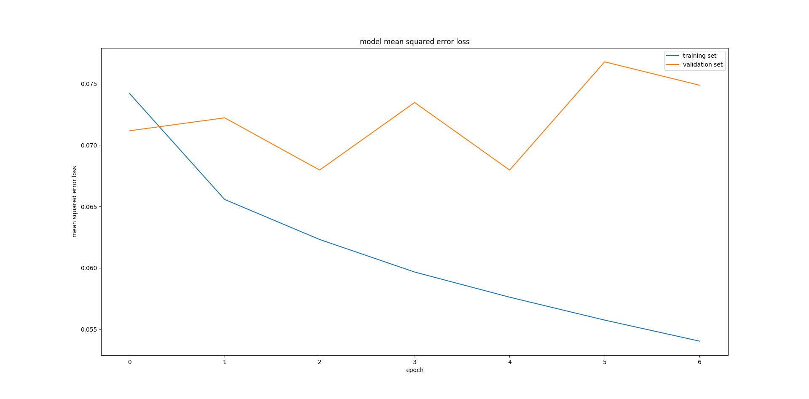
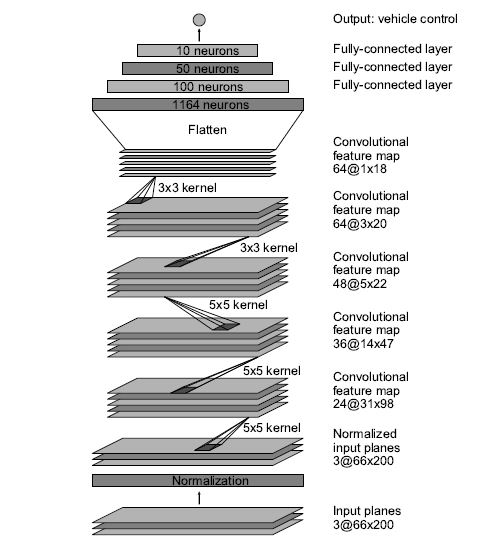

# Behavioral Cloning

---

### Behavioral Cloning Project

The goals / steps of this project are the following:

* Use the simulator to collect data of good driving behavior
* Build, a convolution neural network in Keras that predicts steering angles from images
* Train and validate the model with a training and validation set
* Test that the model successfully drives around track one without leaving the road
* Summarize the results with a written report

## Rubric Points

Here I will consider the [rubric points](https://review.udacity.com/#!/rubrics/432/view) individually and describe how I addressed each point in my implementation.  

CRITERIA | MEETS SPECIFICATIONS | HOW I ADDRESSED THE POINT | 
--- | --- | --- |
Are all required files submitted? | The submission includes a model.py file, drive.py, model.h5 a writeup report and video.mp4. |  The repository containes model.py file, drive.py, model.h5 a writeup report and video.mp4| 
Is the code functional? | The model provided can be used to successfully operate the simulation. |  Yes as it can be showed by the video of simulation| 
Is the code usable and readable? | The code in model.py uses a Python generator, if needed, to generate data for training rather than storing the training data in memory. The model.py code is clearly organized and comments are included where needed. |  | 
Has an appropriate model architecture been employed for the task? | The neural network uses convolution layers with appropriate filter sizes. Layers exist to introduce nonlinearity into the model. The data is normalized in the model. |  | 
Has an attempt been made to reduce overfitting of the model? | Train/validation/test splits have been used, and the model uses dropout layers or other methods to reduce overfitting. |  | 
Have the model parameters been tuned appropriately? | Learning rate parameters are chosen with explanation, or an Adam optimizer is used. |  | 
Is the training data chosen appropriately? | Training data has been chosen to induce the desired behavior in the simulation (i.e. keeping the car on the track). |  | 
Is the solution design documented? | The README thoroughly discusses the approach taken for deriving and designing a model architecture fit for solving the given problem. |  | 
Is the model architecture documented? | The README provides sufficient details of the characteristics and qualities of the architecture, such as the type of model used, the number of layers, the size of each layer. Visualizations emphasizing particular qualities of the architecture are encouraged. |  | 
Is the creation of the training dataset and training process documented? | The README describes how the model was trained and what the characteristics of the dataset are. Information such as how the dataset was generated and examples of images from the dataset must be included. |  | 
Is the car able to navigate correctly on test data? | No tire may leave the drivable portion of the track surface. The car may not pop up onto ledges or roll over any surfaces that would otherwise be considered unsafe (if humans were in the vehicle). |  | 

---

### Files Submitted & Code Quality

#### 1. Submission includes all required files and can be used to run the simulator in autonomous mode

Project includes the following files:

* __model.py__ containing the script to create and train the model
* __drive.py__ for driving the car in autonomous mode
* __model.h5__ containing a trained convolution neural network 
* __video.mp4__ containing the video showing that the vehicle is able to drive autonomously around the track without leaving the road (see on [YouTube](https://youtu.be/lzqxdYs-e4Y))
* __writeup_report.md__ summarizing the results

#### 2. Submission includes functional code
Using the Udacity provided simulator and my drive.py file, the car can be driven autonomously around the track by executing 
```sh
python drive.py model.h5
```

#### 3. Submission code is usable and readable

The __model.py__ file contains the code for training and saving the convolution neural network. The file shows the pipeline I used for training and validating the model, and it contains comments to explain how the code works. Also, the script can be parametrized as here explained:  

OPTION | SELECTOR | DEFAULT | DESCRIPTION | 
--- | --- | --- | --- |
__data directory__ | '-d' | default='data' | |
__test size fraction__ |'-t' | default=0.2 | |
__drop out probability__ | '-k' | default=0.5 | |
__number of epochs__ | '-n' | default=3 | |
__batch size__ | '-b' | default=32 | |
__learning rate__ | '-l'| default=1.0e-4 | |
__visualize loss__ | '-v' | default=0  | if enabled, it plots the training and validation loss for each epoch |
__output model__ | '-o'| default='model.h5' | |
__flip images__ | '-d'| default=1 | if enabled, it augment the images by flipping images and taking the opposite sign of the steering measurement | 
__rand brightness__ | '-d' | default=1 | if enabled, it augment the images by augment brightness randomly |

---

### Model Architecture and Training Strategy

#### 1. An appropriate model architecture has been employed

The model (model.py, lines 76-114) is ispired to the convolution neural network described in [Mariusz Bojarski et al., _End to End Learning for Self-Driving Cars_, arXiv:1604.07316v1 [cs.CV] 25 Apr 2016](http://images.nvidia.com/content/tegra/automotive/images/2016/solutions/pdf/end-to-end-dl-using-px.pdf) 


The network architecture consists of 9 layers, including a normalization layer, 5 convolutional layers and 3 fully connected layers:

* The input image is properly cropped and passed to the network 
* The first layer of the network performs image normalization
* The convolutional layers are designed to perform feature extraction and were chosen empirically through a series of experiments that varied layer configurations. We use strided convolutions in the first three convolutional layers with a 2x2 stride and a 5x5 kernel and a non-strided convolution with a 3x3 kernel size in the last two convolutional layers
* We follow the five convolutional layers with a dropout layer for reducing overfitting  
* We follow the dropout layer with three fully connected layers leading to an output control value which is the inverse turning radius 


#### 2. Attempts to reduce overfitting in the model

The model contains a dropout layer in order to reduce overfitting (model.py, line 106) and it was trained and validated on different data sets to ensure that the model was not overfitting (code line 124-132). The model was tested by running it through the simulator and ensuring that the vehicle could stay on the track. As below shown, the __best drop out probability__ is __0.5__. 


##### **Drop out probability set to 0**

 


##### **Drop out probability set to 0.5**

 


##### **Drop out probability set to 0.75**

 


####3. Model parameter tuning

The model used an adam optimizer (model.py line 138), that is an algorithm for first-order gradient-based optimization of stochastic objective functions, based on adaptive estimates of lower-order moments. For further details, see [Diederik P. Kingma et al, _ADAM: A METHOD FOR STOCHASTIC OPTIMIZATION_, arXiv:1412.6980v8 [cs.LG] 23 Jul 2015](https://arxiv.org/pdf/1412.6980v8.pdf). 

#### 4. Appropriate training data

Training data was chosen to keep the vehicle driving on the road. I used a combination of brakeless driving, driving using brake and driving counter-clockwise to reduce left turn bias. 

For details about how I created the training data, see the next section. 

### Model Architecture and Training Strategy

#### 1. Solution Design Approach

* My first step was to use [sample training data](https://d17h27t6h515a5.cloudfront.net/topher/2016/December/584f6edd_data/data.zip) to train a simple linear regressor. As the track and the brightness were different I applied the grayscale transformation and gaussian blur ( kernel_size=5) to images in order to reuse these data on the track of simulator; related results were not bad and I interpreted this as a sign that a better regressor could have been sucessfull; 
* Hence, I used the data described above to feed a Convolutional Neural Network and the car in autonomous mode drove in satisfactory way except for the big curve after the bridge that the car was not able to do properly; 
* In order to fix the problem I augmented data by using several techniques such as flipping images and taking the opposite sign of the steering measurement but without fixing the problem 
* Hence, I decided to change approach: using the training data of a different track of the simulator was probably too stretch, so I collected 3 train sets by using the simulator in training mode:
    * the first train set was collected by driving the car brakeless 
    * the second train set was collected by driving the car using brake 
    * the third train set was collected by driving counter-clockwise (using brake)
* Also, I used the convolution neural network described in [Mariusz Bojarski et al., _End to End Learning for Self-Driving Cars_, arXiv:1604.07316v1 [cs.CV] 25 Apr 2016](http://images.nvidia.com/content/tegra/automotive/images/2016/solutions/pdf/end-to-end-dl-using-px.pdf) adding a dropout layer to reduce overfitting     
* In order to gauge how well the model was working, I split my image and steering angle data into a training and validation set (by default 20%)
* To combat the overfitting, I tuned the drop out probability as described above   
* The final step was to run the simulator to see how well the car was driving around track one and the vehicle was able to drive autonomously around the track without leaving the road

#### 2. Final Model Architecture

The final model architecture was inspired to [Mariusz Bojarski et al., _End to End Learning for Self-Driving Cars_, arXiv:1604.07316v1 [cs.CV] 25 Apr 2016](http://images.nvidia.com/content/tegra/automotive/images/2016/solutions/pdf/end-to-end-dl-using-px.pdf) and it consisted of a convolution neural network with 9 layers, including a normalization layer, 5 convolutional layers and 3 fully connected layers:

* The input image is properly cropped and passed to the network 
* The first layer of the network performs image normalization
* The convolutional layers are designed to perform feature extraction and were chosen empirically through a series of experiments that varied layer configurations. We use strided convolutions in the first three convolutional layers with a 2x2 stride and a 5x5 kernel and a non-strided convolution with a 3x3 kernel size in the last two convolutional layers
* We follow the five convolutional layers with a dropout layer for reducing overfitting  
* We follow the dropout layer with three fully connected layers leading to an output control value which is the inverse turning radius 

Here is a detailed description of the architecture. 

| Layer         		|     Description	        					| 
|:---------------------:|:---------------------------------------------:| 
| Input         		| 66x200x3 RGB resized and cropped images    							| 
| Image normalization     	|  	|
| Convolution 5x5     	| filter: 24, strides: 2x2 	|
| ELU					|										|
| Convolution 5x5     	| filter: 36, strides: 2x2 	|
| ELU					|										|
| Convolution 5x5     	| filter: 48, strides: 2x2	|
| ELU					|										|
| Convolution 5x5     	| filter: 64, strides: 1x1 	|
| ELU					|										|
| Convolution 5x5     	| filter: 64, strides: 1x1 	|
| ELU					|										|
| DROPOUT					|				only for training, keep probabily = 0.5							|
| Fully connected		| 100 neurons        									|
| Fully connected		| 50 neurons        									|
| Fully connected		| 10 neurons        									|
| Fully connected		| 1 neurons        									|


Here is a visualization of the original architecture from [Mariusz Bojarski et al., _End to End Learning for Self-Driving Cars_, arXiv:1604.07316v1 [cs.CV] 25 Apr 2016](http://images.nvidia.com/content/tegra/automotive/images/2016/solutions/pdf/end-to-end-dl-using-px.pdf) that is a special case of the above one (drop out probability set to 0). 


 


#### 3. Creation of the Training Set & Training Process

To capture good driving behavior, I first recorded two laps on track one using center lane driving. Here is an example image of center lane driving:


I then recorded the vehicle recovering from the left side and right sides of the road back to center so that the vehicle would learn to .... These images show what a recovery looks like starting from ... :

![alt text][image3]
![alt text][image4]
![alt text][image5]

Then I repeated this process on track two in order to get more data points.

To augment the data sat, I also flipped images and angles thinking that this would ... For example, here is an image that has then been flipped:

![alt text][image6]
![alt text][image7]

Etc ....

After the collection process, I had X number of data points. I then preprocessed this data by ...


I finally randomly shuffled the data set and put Y% of the data into a validation set. 

I used this training data for training the model. The validation set helped determine if the model was over or under fitting. The ideal number of epochs was Z as evidenced by ... I used an adam optimizer so that manually training the learning rate wasn't necessary.
