## Writeup 

---

**Advanced Lane Finding Project**

The goals / steps of this project are the following:

* Compute the camera calibration matrix and distortion coefficients given a set of chessboard images.
* Apply a distortion correction to raw images.
* Use color transforms, gradients, etc., to create a thresholded binary image.
* Apply a perspective transform to rectify binary image ("birds-eye view").
* Detect lane pixels and fit to find the lane boundary.
* Determine the curvature of the lane and vehicle position with respect to center.
* Warp the detected lane boundaries back onto the original image.
* Output visual display of the lane boundaries and numerical estimation of lane curvature and vehicle position.


## [Rubric](https://review.udacity.com/#!/rubrics/571/view) Points

### Here I will consider the rubric points individually and describe how I addressed each point in my implementation.  


### Camera Calibration

#### 1. Briefly state how you computed the camera matrix and distortion coefficients. Provide an example of a distortion corrected calibration image.

I start by preparing "object points", which will be the (x, y, z) coordinates of the chessboard corners in the world. Here I am assuming the chessboard is fixed on the (x, y) plane at z=0, such that the object points are the same for each calibration image.  Thus, `objp` is just a replicated array of coordinates, and `objpoints` will be appended with a copy of it every time I successfully detect all chessboard corners in a test image.  `imgpoints` will be appended with the (x, y) pixel position of each of the corners in the image plane with each successful chessboard detection.  

I then used the output `objpoints` and `imgpoints` to compute the camera calibration and distortion coefficients using the `cv2.calibrateCamera()` function.  I applied this distortion correction to the test image using the `cv2.undistort()` function and obtained this result: 

Original Image | Undistorted Image |
--- | --- | 
   | 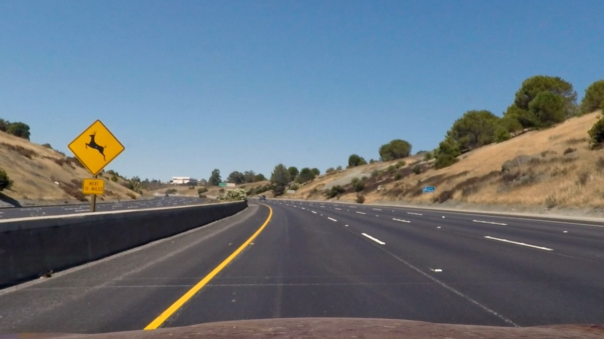  | 

Other examples can be found here. 

Original Image | Undistorted Image |
--- | --- | 
[test1](test_images/test1.jpg) | [test1 undistorted](output_images/test1_undistort.png) | 
[test2](test_images/test2.jpg) | [test1 undistorted](output_images/test2_undistort.png) | 
[test3](test_images/test3.jpg) | [test1 undistorted](output_images/test3_undistort.png) | 
[test4](test_images/test4.jpg) | [test1 undistorted](output_images/test4_undistort.png) | 
[test5](test_images/test5.jpg) | [test1 undistorted](output_images/test5_undistort.png) | 
[test6](test_images/test6.jpg) | [test1 undistorted](output_images/test6_undistort.png) | 

Related code can be found in cells #5-#7 of Advanced_Lane_Finding_Notebook.ipynb. 


### Pipeline (single images)

#### 1. Provide an example of a distortion-corrected image.

Original Image | Undistorted Image |
--- | --- | 
   |   | 

Other examples can be found here. 

Original Image | Undistorted Image |
--- | --- | 
[test1](test_images/test1.jpg) | [test1 undistorted](output_images/test1_undistort.png) | 
[test2](test_images/test2.jpg) | [test1 undistorted](output_images/test2_undistort.png) | 
[test3](test_images/test3.jpg) | [test1 undistorted](output_images/test3_undistort.png) | 
[test4](test_images/test4.jpg) | [test1 undistorted](output_images/test4_undistort.png) | 
[test5](test_images/test5.jpg) | [test1 undistorted](output_images/test5_undistort.png) | 
[test6](test_images/test6.jpg) | [test1 undistorted](output_images/test6_undistort.png) | 

Related code can be found in cells #5-#7 of Advanced_Lane_Finding_Notebook.ipynb. 

#### 2. Describe how (and identify where in your code) you used color transforms, gradients or other methods to create a thresholded binary image.  Provide an example of a binary image result.

I used a combination of color and gradient thresholds to generate a binary image.  Related code can be found in cells from #8 to #17 of Advanced_Lane_Finding_Notebook.ipynb. 


I combined two pipelines:

1. converted to HSV color space and extratced S and L channels, took the derivative in x and its absolute to accentuate lines away from horizontal, thresholded x gradient, thresholded color channel and finally combined the binary thresholds
2. applied Sobel transform and extracted gradient in x an y direction, thresholded magnitude and direction and finally combined the binary thresholds


Here's examples of my output for this step.  


Original Image | Thresholded Binary Image |
--- | --- | 
 | 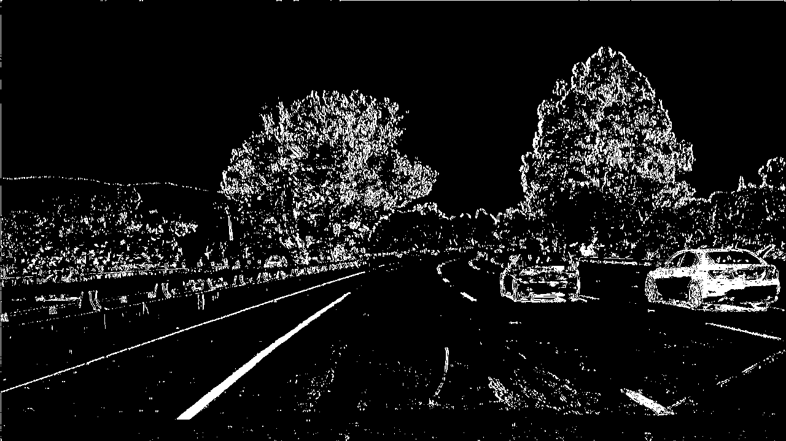  | 
 | 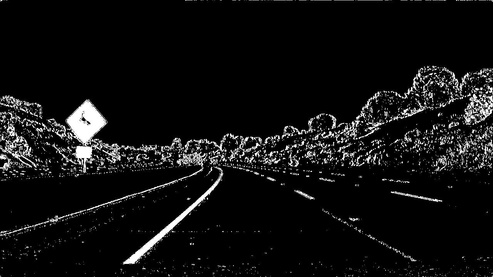  | 
 | 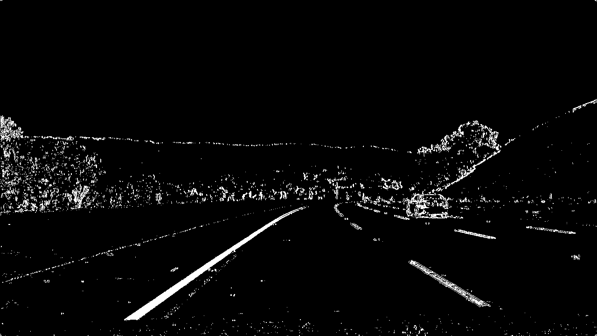  | 
 | 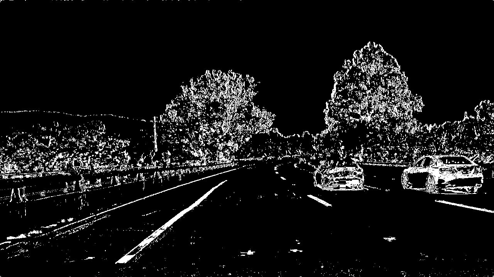  | 
 | 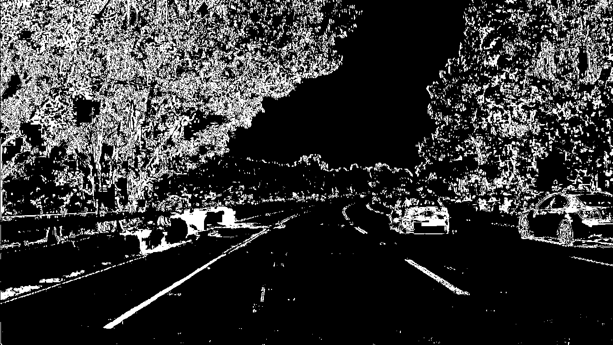  | 
 | 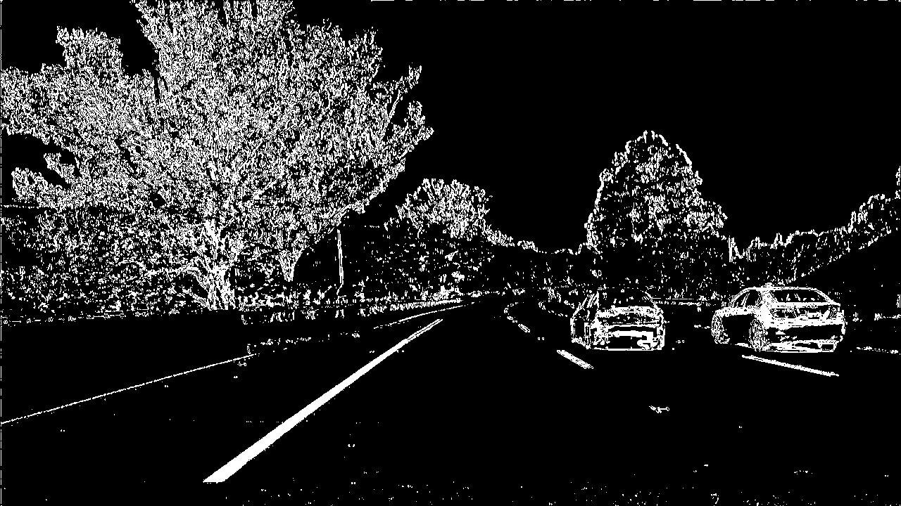  | 


#### 3. Describe how (and identify where in your code) you performed a perspective transform and provide an example of a transformed image.

Please refer to cells #18-#20 of Advanced_Lane_Finding_Notebook.ipynb. I chose the hardcode the source and destination points in the following manner:

```python
src = np.float32(
    [[(img_size[0] / 2) - 55, img_size[1] / 2 + 100],
    [((img_size[0] / 6) - 10), img_size[1]],
    [(img_size[0] * 5 / 6) + 60, img_size[1]],
    [(img_size[0] / 2 + 55), img_size[1] / 2 + 100]])
dst = np.float32(
    [[(img_size[0] / 4), 0],
    [(img_size[0] / 4), img_size[1]],
    [(img_size[0] * 3 / 4), img_size[1]],
    [(img_size[0] * 3 / 4), 0]])
```

This resulted in the following source and destination points for the image _test_images/straight_lines1.jpg_:

| Source        | Destination   | 
|:-------------:|:-------------:| 
| 585, 460      | 320, 0        | 
| 203, 720      | 320, 720      |
| 1127, 720     | 960, 720      |
| 695, 460      | 960, 0        |

I verified that my perspective transform was working as expected by drawing the `src` and `dst` points onto a test image and its warped counterpart to verify that the lines appear parallel in the warped image.

| Undistorted image with source points drawn        | Warped result with dest.points drawn   | 
|:-------------:|:-------------:| 
| 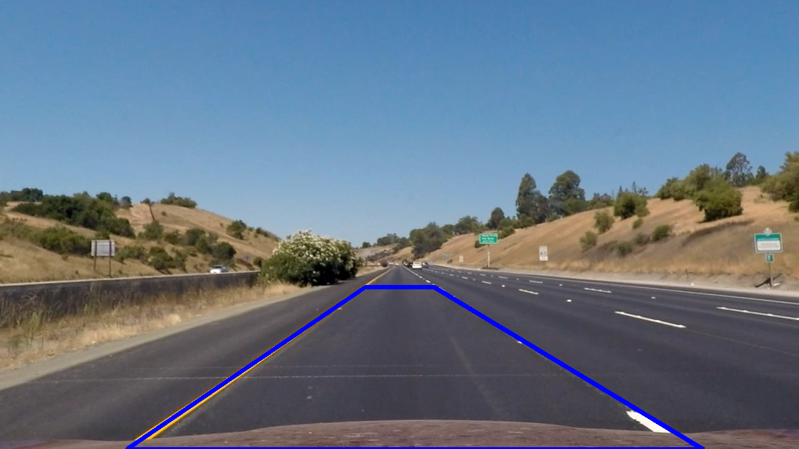      | 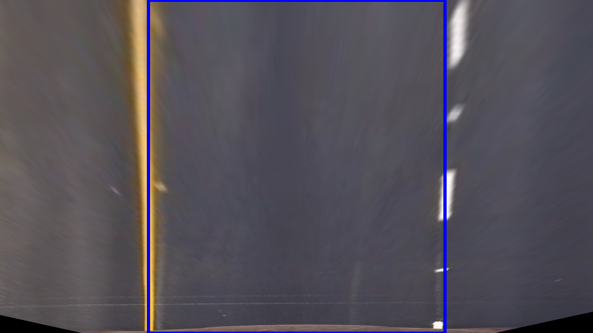       | 
| 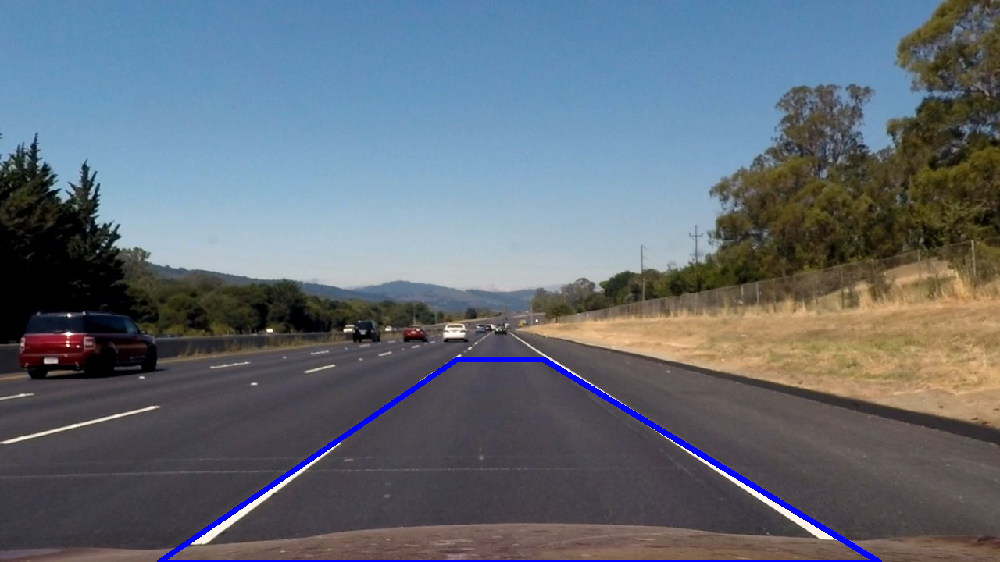      | 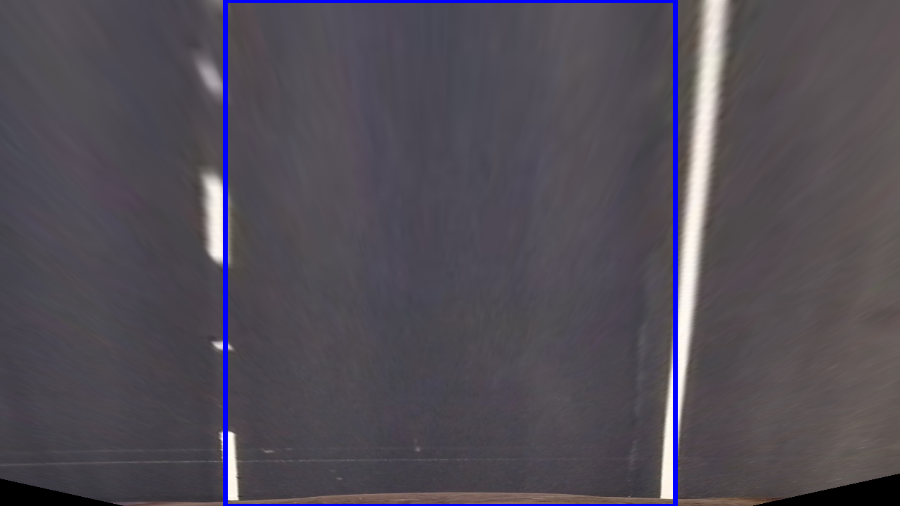       | 


#### 4. Describe how (and identify where in your code) you identified lane-line pixels and fit their positions with a polynomial?

Then I fit my the perspective transformed and thresholded image with a 2nd order polynomial using a sliding histogram approach. I start at the maximum peaks in the bottom half of the image and move our way up. I then subsequently search for the line with the same approach and finally fit a polynomial (see #21-#26 of Advanced_Lane_Finding_Notebook.ipynb)


#### 5. Describe how (and identify where in your code) you calculated the radius of curvature of the lane and the position of the vehicle with respect to center.

Please refer to cells #26-#27 of Advanced_Lane_Finding_Notebook.ipynb. 

This approach calculates curvature for given polynomial fits. 

#### 6. Provide an example image of your result plotted back down onto the road such that the lane area is identified clearly.

Please refer to cells #28-#30 of Advanced_Lane_Finding_Notebook.ipynb.  Here is an example of my result on a test image:


|         |    | 
|:-------------:|:-------------:| 
|       |        | 
|       | 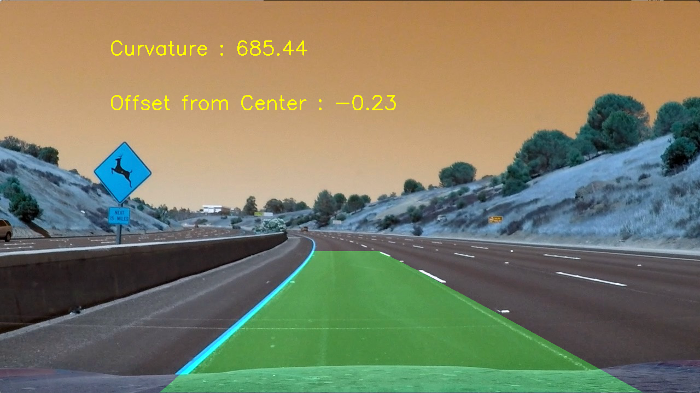       | 
|       |        | 
| 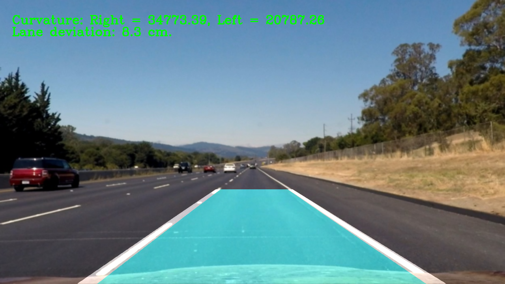      | 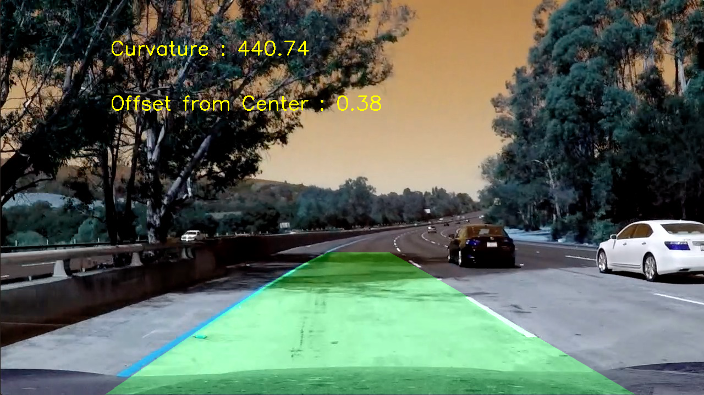       | 


---

### Pipeline (video)

#### 1. Provide a link to your final video output.  Your pipeline should perform reasonably well on the entire project video (wobbly lines are ok but no catastrophic failures that would cause the car to drive off the road!).

Here's a [link to my video result](https://youtu.be/pf64NCrA7eY)

---

### Discussion

#### 1. Briefly discuss any problems / issues you faced in your implementation of this project.  Where will your pipeline likely fail?  What could you do to make it more robust?

The approach here adopted is based on the following steps: 

1. Camera calibration 
2. Distortion correction 
3. Color & gradient threshold 
4. Perspective transform  
5. Fit lane-line pixels with a polinomial 
6. Calculate the radius of curvature of the lane and the position of the vehicle with respect to center

As a conseguence, each time main assumptions of such approach are not satisfied the pipeline might fail, e.g. 

* There are no lane lines 
* Lane lines are not clearly visible on the road because of obsolescence or other reasons 
* Bad wheater might introduce noise we did not test our pipeline with 
 


