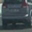
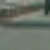
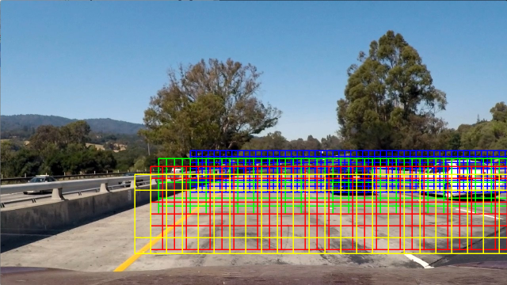

# Vehicle Detection Project

The goals / steps of this project are the following:

* Perform a Histogram of Oriented Gradients (HOG) feature extraction on a labeled training set of images and train a classifier Linear SVM classifier
* Optionally, you can also apply a color transform and append binned color features, as well as histograms of color, to your HOG feature vector. 
* Note: for those first two steps don't forget to normalize your features and randomize a selection for training and testing.
* Implement a sliding-window technique and use your trained classifier to search for vehicles in images.
* Run your pipeline on a video stream (start with the test_video.mp4 and later implement on full project_video.mp4) and create a heat map of recurring detections frame by frame to reject outliers and follow detected vehicles.
* Estimate a bounding box for vehicles detected.

# [Rubric](https://review.udacity.com/#!/rubrics/513/view) Points

TODO  

---

# Histogram of Oriented Gradients (HOG)

### 1. Explain how (and identify where in your code) you extracted HOG features from the training images.

The code for this step is contained in the first code cell of the IPython notebook (Classifier_EDA.ipynb line #2).

I started by reading in all the vehicle and non-vehicle images. Here is an example of one of each of the vehicle and non-vehicle classes. I then explored different color spaces and different `skimage.hog()` parameters (`orientations`, `pixels_per_cell`, and `cells_per_block`).

vehicle | Non-vehicle |
--- | --- | 
    |   | 

### 2. Explain how you settled on your final choice of HOG parameters.

I discarded RGB color space for its undesirable properties under changing light conditions. I ended up using YUV color space and HOG parameters of orientations=11, pixels_per_cell=(16, 16) and cells_per_block=2.

### 3. Describe how (and identify where in your code) you trained a classifier using your selected HOG features (and color features if you used them).

I trained and validated several models by using 4-fold cross validation as resample procedure. 
This choice seems safe considering the fact we have >17K observations.   

Predictive_Model |	Parameters |	Accuracy_Mean	| Accuracy_STD |	Predict_Time
--- | --- | --- | --- | --- |
LinearSVC	| {'loss': 'hinge'}	| 0.992286	| 0.000683	| 0.293750
LogisticRegression	| {'C': 0.1} |	0.993919 |	0.000552 |	0.316752
RandomForest	| {'criterion': 'gini', 'max_depth': None, 'n_estimators': 1000}	| 0.994707	| 0.001784	| 4.457001
KNeighborsClassifier 	| 	{'weights': 'distance', 'n_neighbors': 5}		| 0.995721		|  0.000828		|  698.066331
SVC		| {'kernel': 'rbf', 'C': 5}		| 0.997691		| 0.000537		| 67.464008

The most fast model in computing score on new images is LinearSVC and the difference in terms of acccuracy is negligible.

**Note**: SVC with radial kernel has better accuracy than SVC with linear kernel but we have ~67 secs to score on test set on average instead of < 1 sec. 

# Sliding Window Search

## 1. Describe how (and identify where in your code) you implemented a sliding window search.  How did you decide what scales to search and how much to overlap windows?

A grid of sliding windows is created in such a way that only the regions that could potentially have vehicles are retained. For example, the sky is removed, the bottom that has the bonnet is removed. This increases the speed of detection and reduces false positives. Also, different scales are used to create sliding windows, with the ones near the horizon being smaller, the ones closer to the camera car are larger. A total of four different scales have been used.

## 2. Show some examples of test images to demonstrate how your pipeline is working.  What did you do to optimize the performance of your classifier?

Thresholding the heatmap helps to reduce false positives. I used a threshold of 4. Detections that are not covered by a minimum number of sliding windows are discarded. The heatmap also helps combine duplicate detections into a single detection. Also, heatmaps in previous frames are considered according to the following equation `previousHeatmap*0.2 + currentHeatmap*(1 - 0.2)`. 

---

# Video Implementation

## 1. Provide a link to your final video output.  Your pipeline should perform reasonably well on the entire project video (somewhat wobbly or unstable bounding boxes are ok as long as you are identifying the vehicles most of the time with minimal false positives.)

Here's a [link to my video result](https://youtu.be/sm5b6fb9DZY)

## 2. Describe how (and identify where in your code) you implemented some kind of filter for false positives and some method for combining overlapping bounding boxes.

I recorded the positions of positive detections in each frame of the video.  From the positive detections I created a heatmap and then thresholded that map to identify vehicle positions.  I then used `scipy.ndimage.measurements.label()` to identify individual blobs in the heatmap.  I then assumed each blob corresponded to a vehicle.  I constructed bounding boxes to cover the area of each blob detected.  

Here's an example result showing the heatmap from a series of frames of video, the result of `scipy.ndimage.measurements.label()` and the bounding boxes then overlaid on the last frame of video:

## Here are six frames and their corresponding heatmaps:

![alt text][image5]

### Here is the output of `scipy.ndimage.measurements.label()` on the integrated heatmap from all six frames:
![alt text][image6]

### Here the resulting bounding boxes are drawn onto the last frame in the series:
![alt text][image7]

---

# Discussion

## 1. Briefly discuss any problems / issues you faced in your implementation of this project.  Where will your pipeline likely fail?  What could you do to make it more robust?

Here I'll talk about the approach I took, what techniques I used, what worked and why, where the pipeline might fail and how I might improve it if I were going to pursue this project further.  

