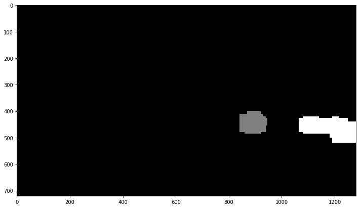
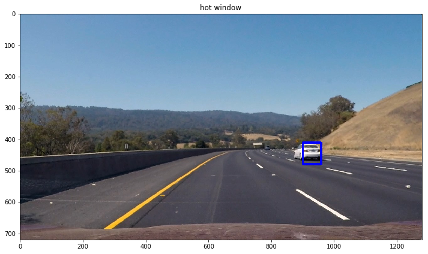

# Vehicle Detection Project

The goals / steps of this project are the following:

* Perform a Histogram of Oriented Gradients (HOG) feature extraction on a labeled training set of images and train a classifier Linear SVM classifier
* Optionally, you can also apply a color transform and append binned color features, as well as histograms of color, to your HOG feature vector. 
* Note: for those first two steps don't forget to normalize your features and randomize a selection for training and testing.
* Implement a sliding-window technique and use your trained classifier to search for vehicles in images.
* Run your pipeline on a video stream (start with the test_video.mp4 and later implement on full project_video.mp4) and create a heat map of recurring detections frame by frame to reject outliers and follow detected vehicles.
* Estimate a bounding box for vehicles detected.

# [Rubric](https://review.udacity.com/#!/rubrics/513/view) Points

CRITERIA | MEETS SPECIFICATIONS | HOW I ADDRESSED THE POINT | 
--- | --- | --- |
Provide a Writeup / README that includes all the rubric points and how you addressed each one. You can submit your writeup as markdown or pdf. Here is a template writeup for this project you can use as a guide and a starting point. | The writeup / README should include a statement and supporting figures / images that explain how each rubric item was addressed, and specifically where in the code each step was handled. | Please refer to this document |
Explain how (and identify where in your code) you extracted HOG features from the training images. Explain how you settled on your final choice of HOG parameters. | Explanation given for methods used to extract HOG features, including which color space was chosen, which HOG parameters (orientations, pixels_per_cell, cells_per_block), and why. | Please refer to section _1. Explain how (and identify where in your code) you extracted HOG features from the training images_ |
Describe how (and identify where in your code) you trained a classifier using your selected HOG features (and color features if you used them). | The HOG features extracted from the training data have been used to train a classifier, could be SVM, Decision Tree or other. Features should be scaled to zero mean and unit variance before training the classifier. | Please refer to section _3. Describe how (and identify where in your code) you trained a classifier using your selected HOG features (and color features if you used them)._ |
Describe how (and identify where in your code) you implemented a sliding window search. How did you decide what scales to search and how much to overlap windows? | A sliding window approach has been implemented, where overlapping tiles in each test image are classified as vehicle or non-vehicle. Some justification has been given for the particular implementation chosen. | Please refer to section _1. Describe how (and identify where in your code) you implemented a sliding window search.  How did you decide what scales to search and how much to overlap windows?_ |
Show some examples of test images to demonstrate how your pipeline is working. How did you optimize the performance of your classifier? | Some discussion is given around how you improved the reliability of the classifier i.e., fewer false positives and more reliable car detections (this could be things like choice of feature vector, thresholding the decision function, hard negative mining etc.) | please refer to _2. Show some examples of test images to demonstrate how your pipeline is working.  What did you do to optimize the performance of your classifier?_ |
Provide a link to your final video output. Your pipeline should perform reasonably well on the entire project video (somewhat wobbly or unstable bounding boxes are ok as long as you are identifying the vehicles most of the time with minimal false positives.) | The sliding-window search plus classifier has been used to search for and identify vehicles in the videos provided. Video output has been generated with detected vehicle positions drawn (bounding boxes, circles, cubes, etc.) on each frame of video. | Please refer to section _1. Provide a link to your final video output.  Your pipeline should perform reasonably well on the entire project video (somewhat wobbly or unstable bounding boxes are ok as long as you are identifying the vehicles most of the time with minimal false positives.)_ |
Describe how (and identify where in your code) you implemented some kind of filter for false positives and some method for combining overlapping bounding boxes. | A method, such as requiring that a detection be found at or near the same position in several subsequent frames, (could be a heat map showing the location of repeat detections) is implemented as a means of rejecting false positives, and this demonstrably reduces the number of false positives. Same or similar method used to draw bounding boxes (or circles, cubes, etc.) around high-confidence detections where multiple overlapping detections occur. | Please refer to section _2. Describe how (and identify where in your code) you implemented some kind of filter for false positives and some method for combining overlapping bounding boxes._ |
Briefly discuss any problems / issues you faced in your implementation of this project. Where will your pipeline likely fail? What could you do to make it more robust? | Discussion includes some consideration of problems/issues faced, what could be improved about their algorithm/pipeline, and what hypothetical cases would cause their pipeline to fail. | Please refer to section _1. Briefly discuss any problems / issues you faced in your implementation of this project.  Where will your pipeline likely fail?  What could you do to make it more robust?_ |

---

# Histogram of Oriented Gradients (HOG)

### 1. Explain how (and identify where in your code) you extracted HOG features from the training images.

The code for this step is contained in the first code cell of the IPython notebook (Classifier_EDA.ipynb line #2).

I started by reading in all the vehicle and non-vehicle images. Here is an example of one of each of the vehicle and non-vehicle classes. I then explored different color spaces and different `skimage.hog()` parameters (`orientations`, `pixels_per_cell`, and `cells_per_block`).

vehicle | Non-vehicle |
--- | --- | 
    |   | 

### 2. Explain how you settled on your final choice of HOG parameters.

I discarded RGB color space for its undesirable properties under changing light conditions. I ended up using YUV color space and HOG parameters of orientations=11, pixels_per_cell=(16, 16) and cells_per_block=2.

The code is in the IPython notebook Classifier_EDA.ipynb. 

#### Post-Evaluation

Good job using YUV color channel! A suggestion would be to try YCrCb using just HOG, research suggests it is more powerful!

[Check it out](https://pure.tue.nl/ws/files/3283178/Metis245392.pdf)

### 3. Describe how (and identify where in your code) you trained a classifier using your selected HOG features (and color features if you used them).

I trained and validated several models by using 4-fold cross validation as resample procedure. 
This choice seems safe considering the fact we have >17K observations.   

Predictive_Model |	Parameters |	Accuracy_Mean	| Accuracy_STD |	Predict_Time
--- | --- | --- | --- | --- |
LinearSVC	| {'loss': 'hinge'}	| 0.992286	| 0.000683	| 0.293750
LogisticRegression	| {'C': 0.1} |	0.993919 |	0.000552 |	0.316752
RandomForest	| {'criterion': 'gini', 'max_depth': None, 'n_estimators': 1000}	| 0.994707	| 0.001784	| 4.457001
KNeighborsClassifier 	| 	{'weights': 'distance', 'n_neighbors': 5}		| 0.995721		|  0.000828		|  698.066331
SVC		| {'kernel': 'rbf', 'C': 5}		| 0.997691		| 0.000537		| 67.464008

The most fast model in computing score on new images is LinearSVC and the difference in terms of acccuracy is negligible.

**Note**: SVC with radial kernel has better accuracy than SVC with linear kernel but we have ~67 secs to score on test set on average instead of < 1 sec. 

The code is in the IPython notebook Classifier_EDA.ipynb. 

# Sliding Window Search

## 1. Describe how (and identify where in your code) you implemented a sliding window search.  How did you decide what scales to search and how much to overlap windows?

A grid of sliding windows is created in such a way that only the regions that could potentially have vehicles are retained. For example, the sky is removed, the bottom that has the bonnet is removed. This increases the speed of detection and reduces false positives. Also, different scales are used to create sliding windows, with the ones near the horizon being smaller, the ones closer to the camera car are larger. A total of four different scales have been used.

The code is in the IPython notebook Search_Classify.ipynb (cell # 23). 

## 2. Show some examples of test images to demonstrate how your pipeline is working.  What did you do to optimize the performance of your classifier?

Thresholding the heatmap helps to reduce false positives. I used a threshold of 4. Detections that are not covered by a minimum number of sliding windows are discarded. The heatmap also helps combine duplicate detections into a single detection. Also, heatmaps in previous frames are considered according to the following equation `currentHeatmap = previousHeatmap*0.2 + currentHeatmap*(1 - 0.2)`. 

Initial Image |	All Detections |	Heatmap Before Threshold	| Heatmap After Threshold |	Labeled Regions | Final Result | 
--- | --- | --- | --- | --- | --- |
 |	 	|  |	 |  |  | 
 |	 	|  |	 |  |  | 
 |	 	|  |	 |  |  | 

The code is in the IPython notebook Search_Classify.ipynb. 

---

# Video Implementation

## 1. Provide a link to your final video output.  Your pipeline should perform reasonably well on the entire project video (somewhat wobbly or unstable bounding boxes are ok as long as you are identifying the vehicles most of the time with minimal false positives.)

Here's a [link to my video result](https://youtu.be/sm5b6fb9DZY)

## 2. Describe how (and identify where in your code) you implemented some kind of filter for false positives and some method for combining overlapping bounding boxes.

I recorded the positions of positive detections in each frame of the video.  From the positive detections I created a heatmap and then thresholded that map to identify vehicle positions.  I then used `scipy.ndimage.measurements.label()` to identify individual blobs in the heatmap.  I then assumed each blob corresponded to a vehicle.  I constructed bounding boxes to cover the area of each blob detected.  

Thresholding the heatmap helps to reduce false positives. I used a threshold of 4. Detections that are not covered by a minimum number of sliding windows are discarded. The heatmap also helps combine duplicate detections into a single detection. Also, heatmaps in previous frames are considered according to the following equation `currentHeatmap = previousHeatmap*0.2 + currentHeatmap*(1 - 0.2)`. 

The code is in the IPython notebook Search_Classify.ipynb (cell # 23). 

### Here are six frames and their corresponding heatmaps:

Initial Image |	All Detections |	Heatmap Before Threshold	| Heatmap After Threshold |	Labeled Regions | Final Result | 
--- | --- | --- | --- | --- | --- |
 |	 	|  |	 |  |  | 
 |	 	|  |	 |  |  | 
 |	 	|  |	 |  |  | 
 |	 	|  |	 |  |  | 
 |	 	|  |	 |  |  | 
 |	 	|  |	 |  |  | 

---

# Discussion

## 1. Briefly discuss any problems / issues you faced in your implementation of this project.  Where will your pipeline likely fail?  What could you do to make it more robust?

The predictive model chosen for classifying cars is a SVM with linear kernel but I showed this is not the most accurate model. For example, SVM with radial kernel proved to be more accurate on this dataset but time to score is > 67 secs on my machine. Anyway, the related accuracy of linear SVM is >99% and nonetheless this does not prevent false positives, so that I had to use a heatmap threshold of 4 which is pretty high. This makes me think the whole pipeline is pretty prone to false positives. I wonder if in other videos the heatmap threshold of 4 would be enough. If not, I experimented that thresholds > 5 come with high false negative rate, which would be a major limit for this approach. Also, I wonder how this pipeline would perform in cases where HOG can be chellenged, e.g. roads made of non uniform colors or bad weather conditions.  

There are other approaches based on ConvNets for a comparison. For example, [YOLO](https://arxiv.org/abs/1506.02640) which stands for "You only look once" frames object detection as a regression problem to spatially separated bounding boxes and associated class probabilities. A single neural network predicts bounding boxes and class probabilities directly from full images in one evaluation. Since the whole detection pipeline is a single network, it can be optimized end-to-end directly on detection performance. Base YOLO model processes images in real-time at 45 frames per second and compared to state-of-the-art detection systems, YOLO makes more localization errors but is far less likely to predict false detections where nothing exists. [Here](https://github.com/ksakmann/CarND-Vehicle-Detection/blob/master/output_images/yolo-result.avi) there is the same video of this project processed by YOLO. False positives are practically absent and performances are comparable with our pipeline even without using heatmap threshold although in a couple of frame a car was classified as truck (which is a misclassification error).   

