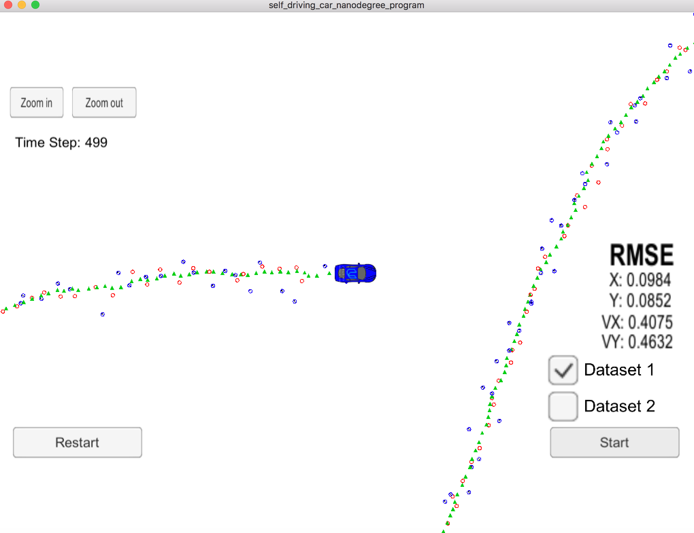

# Extended Kalman Filter Project
Self-Driving Car Engineer Nanodegree Program

In this project I will utilize a kalman filter to estimate the state of a moving object of interest with noisy lidar and radar measurements. Passing the project requires obtaining RMSE values that are lower that the tolerance outlined in the project rubric. 

## Important Dependencies

This project involves the Term 2 Simulator which can be downloaded [here](https://github.com/udacity/self-driving-car-sim/releases)

This repository includes two files that can be used to set up and install [uWebSocketIO](https://github.com/uWebSockets/uWebSockets) for either Linux or Mac systems. For windows you can use either Docker, VMware, or even [Windows 10 Bash on Ubuntu](https://www.howtogeek.com/249966/how-to-install-and-use-the-linux-bash-shell-on-windows-10/) to install uWebSocketIO. Please see [this concept in the classroom](https://classroom.udacity.com/nanodegrees/nd013/parts/40f38239-66b6-46ec-ae68-03afd8a601c8/modules/0949fca6-b379-42af-a919-ee50aa304e6a/lessons/f758c44c-5e40-4e01-93b5-1a82aa4e044f/concepts/16cf4a78-4fc7-49e1-8621-3450ca938b77) for the required version and installation scripts.

## Other Important Dependencies

* cmake >= 3.5
  * All OSes: [click here for installation instructions](https://cmake.org/install/)
* make >= 4.1 (Linux, Mac), 3.81 (Windows)
  * Linux: make is installed by default on most Linux distros
  * Mac: [install Xcode command line tools to get make](https://developer.apple.com/xcode/features/)
  * Windows: [Click here for installation instructions](http://gnuwin32.sourceforge.net/packages/make.htm)
* gcc/g++ >= 5.4
  * Linux: gcc / g++ is installed by default on most Linux distros
  * Mac: same deal as make - [install Xcode command line tools](https://developer.apple.com/xcode/features/)
  * Windows: recommend using [MinGW](http://www.mingw.org/)

## Basic Build Instructions

1. Clone this repo.
2. Make a build directory: `mkdir build && cd build`
3. Compile: `cmake .. && make` 
   * On windows, you may need to run: `cmake .. -G "Unix Makefiles" && make`
4. Run it: `./ExtendedKF `

#  Project Rubric

 

CRITERIA | MEETS SPECIFICATIONS | HOW I ADDRESSED THE POINT | 
--- | --- | --- |
Your code should compile.| Code must compile without errors with cmake and make. Given that we've made CMakeLists.txt as general as possible, it's recommended that you do not change it unless you can guarantee that your changes will still compile on any platform.| After installing all dependencies, executing `mkdir build && cd build` and `cmake .. && make`  you can see the code in `src` compile|
px, py, vx, vy output coordinates must have an RMSE <= [.11, .11, 0.52, 0.52] when using the file: "obj_pose-laser-radar-synthetic-input.txt which is the same data file the simulator uses for Dataset 1"| Your algorithm will be run against Dataset 1 in the simulator which is the same as "data/obj_pose-laser-radar-synthetic-input.txt" in the repository. We'll collect the positions that your algorithm outputs and compare them to ground truth data. Your px, py, vx, and vy RMSE should be less than or equal to the values [.11, .11, 0.52, 0.52].| RMSE is [.0984, .0852, 0.4075, 0.4632 |
Your Sensor Fusion algorithm follows the general processing flow as taught in the preceding lessons.| While you may be creative with your implementation, there is a well-defined set of steps that must take place in order to successfully build a Kalman Filter. As such, your project should follow the algorithm as described in the preceding lesson.| Project follows the algorithm as described in the lesson. Please, see *src/kalman_filter.cpp*|
Your Kalman Filter algorithm handles the first measurements appropriately.| Your algorithm should use the first measurements to initialize the state vectors and covariance matrices.| Please, see *src/FusionEKF.cpp*|
Your Kalman Filter algorithm first predicts then updates.| Upon receiving a measurement after the first, the algorithm should predict object position to the current timestep and then update the prediction using the new measurement.| Please, see *src/FusionEKF.cpp*|
Your Kalman Filter can handle radar and lidar measurements.| Your algorithm sets up the appropriate matrices given the type of measurement and calls the correct measurement function for a given sensor type. | Please, see *src/FusionEKF.cpp* and *src/kalman_filter.cpp*|
Your algorithm should avoid unnecessary calculations.| This is mostly a "code smell" test. Your algorithm does not need to sacrifice comprehension, stability, robustness or security for speed, however it should maintain good practice with respect to calculations. Here are some things to avoid. This is not a complete list, but rather a few examples of inefficiencies. Running the exact same calculation repeatedly when you can run it once, store the value and then reuse the value later. Loops that run too many times. Creating unnecessarily complex data structures when simpler structures work equivalently. Unnecessary control flow checks. | Please, see *src/FusionEKF.cpp*, *src/kalman_filter.cpp* and *src/tools.cpp*|

# Editor Settings, Code Style and Additional Data

## Editor Settings

We've purposefully kept editor configuration files out of this repo in order to
keep it as simple and environment agnostic as possible. However, we recommend
using the following settings:

* indent using spaces
* set tab width to 2 spaces (keeps the matrices in source code aligned)

## Code Style

Please (do your best to) stick to [Google's C++ style guide](https://google.github.io/styleguide/cppguide.html).

## Additional Data

To generate your own radar and lidar data, see the
[utilities repo](https://github.com/udacity/CarND-Mercedes-SF-Utilities) for
Matlab scripts that can generate additional data.